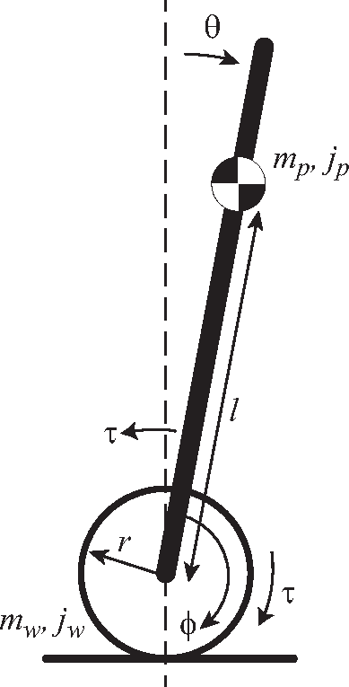
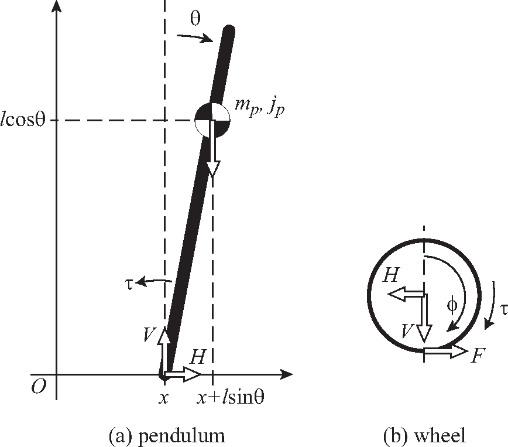
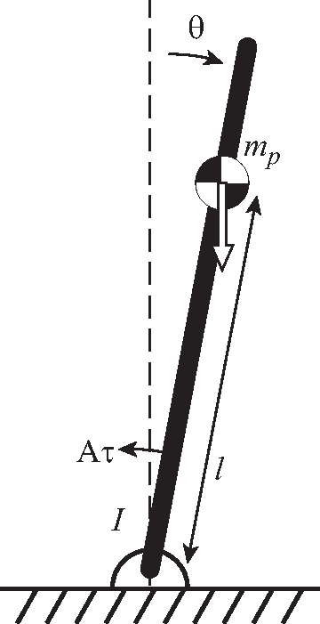
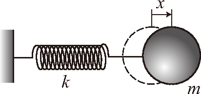
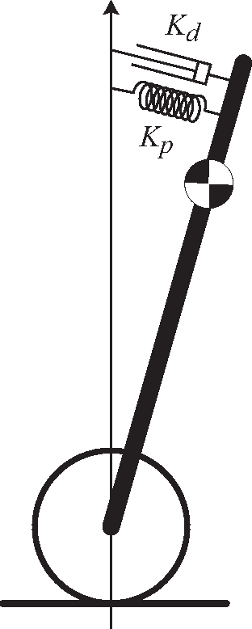
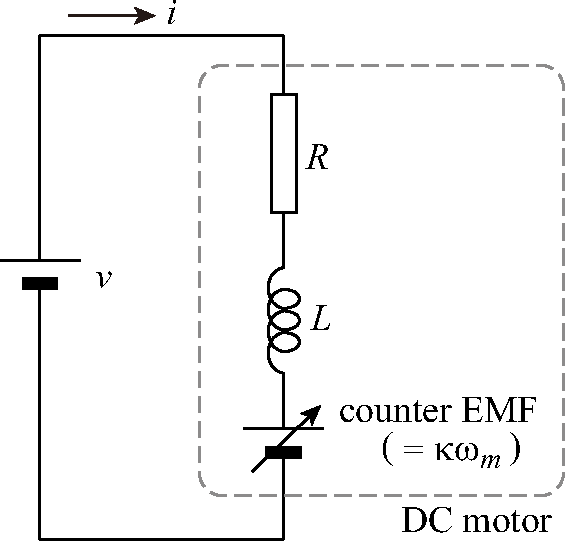

# Purpose of the Exercise {#overview-purpose}

<figure id="fig:pendulum_image">

<figcaption>Wheeled inverted pendulum platform (example).</figcaption>
</figure>

In this exercise, by building a wheeled inverted pendulum (almost) from scratch, we aim to master:

- Basic usage of embedded microcontrollers

- Principle and structure of encoders

- Basics of sensor signal processing

- Basics of feedback control

An inverted pendulum is literally a pendulum that is inverted. An inverted pendulum is unstable, but it can be maintained in a stable inverted state by moving the base part according to the inclination of the pendulum. The operation of moving the base according to the inclination is a typical example of \"feedback control,\" and the inverted pendulum is widely used as an exercise material for control and mechatronics due to its clarity.

There are two types of inverted pendulums: one with a pendulum attached to a linear stage, and one where the pendulum itself travels. The latter corresponds to the wheeled inverted pendulum in this exercise. The principle of the wheeled inverted pendulum is used in mobility devices represented by Segway and wheeled robots.

Although wheeled inverted pendulum kits are commercially available, we will not use such kits in this exercise. Instead, we aim to *understand the configuration and mechanism more deeply by building the inverted pendulum ourselves using only basic parts.* Also, since sensors are very important in feedback control, we would like you to *experience the difficulty and importance of sensors* by making your own sensors (using more primitive sensor elements).

!!! warning "Please read before the exercise"
    - **Pre-study of this text**: Before starting the exercise, read this text to understand the overview of the work and the theoretical background. Starting work without reading the text may lead to fatal mistakes that make it difficult to continue the exercise.

    - **Course materials**: All supplementary materials (debugging tools, example programs, appendix PDFs, MATLAB models) are provided in the course materials repository[^course_materials_repo]. The subfolder contains three essential tools with complete documentation (README files in both Markdown and PDF formats).

    - **PC preparation**: For this practical exercise, we will use the PCs in the design exercise room, so you do not need to prepare your own PC. However, it is possible to use your own PC. In that case, Windows or Macintosh is required. Also, a USB port (Type-A) is required to connect to the control microcontroller. If you only have a Type-C port, please prepare a hub that can connect to Type-A.

    - **On the day**: Installation of the programming environment and assembly of the mechanism will be explained on the day of the exercise.

# Overview of Inverted Pendulum Control {#overview-control}

## Model of the Inverted Pendulum {#overview-model}

First, let's consider the overview of the control of the wheeled inverted pendulum. Figure ([Fig.](#fig:model)) is a simplified model of the inverted pendulum. The pendulum (= body of the inverted pendulum, mass $m_p$, moment of inertia $j_p$) stands from the axis of the tires (mass $m_w$, moment of inertia $j_w$). There is a motor between the tire and the pendulum, and when the motor is driven, opposite torques ($\pm\tau$) are generated on both. Let the horizontal center position of the tire be $x$. For simplicity, assume there is no friction or loss other than the friction acting on the tire from the ground. We want to control the angle of the inverted pendulum $\theta$ and the tire position $x$ (= body position).

<figure id="fig:model">

<figcaption>Simplified model of the wheeled inverted pendulum.</figcaption>
</figure>

Consider the equations of motion for the pendulum and the tire separately as shown in Figure ([Fig.](#fig:model_disassembled)). First, the equation of motion for the pendulum can be written as:

<figure id="fig:model_disassembled">

<figcaption>Forces and torques (disassembled view).</figcaption>
</figure>

$$
\text{Horizontal:}\quad
m_p \frac{d^2}{dt^2}(x+l\sin{\theta})
=m_p (\ddot{x}+l\ddot{\theta}\cos{\theta}-l\dot{\theta}^2\sin{\theta})
= H \label{eq:pH}
$$

$$
\text{Vertical:}\quad
m_p \frac{d^2}{dt^2}(l\cos{\theta})
=-m_p(l\ddot{\theta}\sin{\theta}+l\dot{\theta}^2\cos{\theta})
= V-m_p g \label{eq:pV}
$$

$$
\text{Rotational:}\quad
j_p\ddot{\theta}=lV\sin{\theta}-lH\cos{\theta}-\tau \label{eq:pR}
$$

Here, $H$ and $V$ are the horizontal and vertical components of the force acting between the tire and the pendulum. On the other hand, the equation of motion for the tire is:

$$
\text{Horizontal:}\quad
m_w \ddot{x} = F-H \label{eq:wH}
$$

$$
\text{Rotational:}\quad
j_w\ddot{\phi}=\tau -rF \label{eq:wR}
$$

(The vertical direction is omitted because it balances with the normal force from the ground). Here, $F$ is the friction force received from the ground (which drives the tire), and we assume there is no slip between the tire and the ground ($x=r\phi$). From this series of equations, we eliminate the internal forces $H, V$ and the friction force $F$ to find equations expressed only by the pendulum angle $\theta$ and position $x$.

First, substituting $H, V$ obtained from equations \(\eqref{eq:pH}\) and \(\eqref{eq:pV}\) into equation \(\eqref{eq:pR}\), we get:

$$
j_p\ddot{\theta}=m_p gl \sin{\theta} - m_p l \ddot{x}\cos{\theta} - m_p l^2 \ddot{\theta} -\tau \label{eq:rotation0}
$$

Next, eliminating $F$ from equations \(\eqref{eq:wH}\) and \(\eqref{eq:wR}\) to find $H$:

$$
H = \frac{\tau}{r}-\left( m_w + \frac{j_w}{r^2} \right) \ddot{x} \label{eq:H_elim}
$$

Substituting this into equation \(\eqref{eq:pH}\), we get:

$$
\frac{\tau}{r} = \left( (m_p+m_w) + \frac{j_w}{r^2} \right)\ddot{x} + m_pl\cos{\theta}\ddot{\theta} - l\sin{\theta}\dot{\theta}^2
\label{eq:horizontal0}
$$

Equations \(\eqref{eq:rotation0}\) and \(\eqref{eq:horizontal0}\) are the basic equations of the inverted pendulum. Since these equations contain nonlinear terms (such as $\sin$ and $\dot{\theta}^2$) and are difficult to handle as they are, we linearly approximate them assuming that the inclination angle $\theta$ is minute ($\sin{\theta} \simeq \theta$, $\cos{\theta} \simeq 1$, $\dot{\theta}^2 \simeq 0$). Then, the following pair of linear differential equations is obtained. This is the linear approximation model of the inverted pendulum.

$$
(j_p + m_p l^2)\ddot{\theta} = m_p gl\theta - m_pl\ddot{x}-\tau
\label{eq:rot}
$$

$$
\frac{\tau}{r} = \left( (m_p+m_w)+\frac{j_w}{r^2}\right)\ddot{x} + m_pl\ddot{\theta}
\label{eq:hor}
$$

## Control of Pendulum Angle {#overview-angle-control}

Ultimately, we want to control both the pendulum rotation angle $\theta$ and the body position $x$ simultaneously. However, first, we focus only on the pendulum rotation angle $\theta$ and consider controlling it so that $\theta=0$, that is, simply inverting the pendulum. To do this, find $\ddot{x}$ from equation \(\eqref{eq:hor}\), substitute it into equation \(\eqref{eq:rot}\), and obtain a differential equation for $\theta$ only.

$$
\left(j_p + m_p l^2 \left(1-\frac{m_p}{M}\right) \right)\ddot{\theta} - m_pgl\theta = -\left(1+\frac{m_pl}{Mr}\right)\tau
\label{eq:theta_only}
$$

where $M = m_p + m_w + \frac{j_w}{r^2}$. Since the coefficients are complex, we replace them simply as:

$$
I\ddot{\theta} - m_p gl \theta = -A \tau
\label{eq:simple}
$$

This equation represents the same situation as a pendulum with mass $m_p$ and moment of inertia $I$ around the axis fixed on a shaft, receiving torque $A\tau$ from a motor, as shown in Figure ([Fig.](#fig:simple_pendulum)).

<figure id="fig:simple_pendulum">

<figcaption>Equivalent pendulum (angle dynamics only).</figcaption>
</figure>

Let's consider the behavior of the pendulum in Figure ([Fig.](#fig:simple_pendulum)). When there is no torque from the motor (= no control), equation \(\eqref{eq:simple}\) becomes $I \ddot{\theta} = m_pgl\theta$. Formally, this is the same as the spring equation, so let's compare it with the spring-mass system in Figure ([Fig.](#fig:spring)). The equation of motion for the spring-mass system in Figure ([Fig.](#fig:spring)) is $m\ddot{x}=-kx$. Comparing this with the previous equation, we can see that **the inverted pendulum is equivalent to a spring-mass system with a spring constant of $-m_pgl$.** However, since the spring constant ($-m_pgl$) is negative, it performs an unstable operation exactly opposite to a spring (if it moves slightly away from the equilibrium point, a force acts to move it further away).

<figure id="fig:spring">

<figcaption>Spring-mass system analogy.</figcaption>
</figure>

Thus, the inverted pendulum can be interpreted as unstable because it has a negative spring constant. Therefore, let's consider attaching a spring between it and the vertical axis as shown in Figure ([Fig.](#fig:stabilize)) so that the total combined spring constant (= original negative spring constant + newly attached positive spring constant) becomes positive. If the combined spring constant becomes positive, the pendulum should perform simple harmonic motion near the vertical axis. Furthermore, if a damper (= dashpot: produces a reaction force proportional to velocity) is also attached, the oscillation can be damped, and the inverted pendulum can be made to stand along the vertical axis. However, since we cannot attach a real spring and damper, let's realize the function equivalent to a spring and damper by feedback control.

<figure id="fig:stabilize">

<figcaption>Stabilization via virtual spring and damper (control interpretation).</figcaption>
</figure>

## PD Control {#overview-pd-control}

We consider a method to virtually realize a spring and damper by feedback control. Since the total force of the spring and damper can be expressed as $K_p \theta + K_d \dot{\theta}$, if the pendulum angle $\theta$ (and its derivative $\dot{\theta}$) is known, we can make the motor generate torque such that:

$$
A\tau = K_p \theta + K_d \dot{\theta}
\label{eq:pd}
$$

This allows the motor to play the role of a spring + damper.

As in this example, a control method that feeds back an amount *proportional* to the position or angle (error from the target) and an amount *proportional to the derivative* of the position or angle is called \"**PD control**\". P stands for *Proportional* and D stands for *Derivative*. When only one of them is given, they are called P control (proportional control) and D control (derivative control), respectively. As understood from the above, P control acts equivalently to a spring, and D control acts equivalently to a damper. Also, the respective coefficients ($K_p$, $K_d$) are called P gain (proportional gain) and D gain (derivative gain).

The equation of motion of the PD-controlled pendulum can be expressed from equations \(\eqref{eq:simple}\) and \(\eqref{eq:pd}\) as:

$$
I \ddot{\theta} =  - (K_p - m_pgl) \theta - K_d \dot{\theta} = -K \theta - K_d \dot{\theta}
\label{eq:total}
$$

Here, $K = K_p - m_pgl$ is the spring constant of the combined spring of \"negative spring due to gravity\" and \"positive spring due to control\". From this equation, it can be seen that the PD-controlled inverted pendulum moves in the same way as a spring-mass-damper system with spring constant $K$ and damping coefficient $K_d$. That is, if an angle deviated from the equilibrium point ($\theta=0$) is given as an initial value, it converges to the equilibrium point $\theta=0$ while performing damped oscillation. Since it is the same as a normal spring-mass-damper system, increasing the spring constant ($\approx$ proportional gain) increases the oscillation frequency, and increasing the derivative gain increases damping, causing the oscillation to decay quickly.

## Is this enough to invert? {#overview-is-this-enough}

If you are lucky, controlling the motor torque based on equation \(\eqref{eq:pd}\) alone will keep the inverted pendulum stable. However, in reality, there are many cases where this alone cannot invert it (it inverts for a short time but does not last). The causes are offsets in the inclination sensor that measures the inclination angle $\theta$, and disturbances (forces applied from outside the system, such as wind or desk vibration).

For example, if there is even a slight offset (= deviation in output value) in the inclination sensor, even if it looks like $\theta=0$, the inclination corresponding to the offset actually remains, so the inverted pendulum falls due to gravity. Then, trying to pull up the inverted pendulum, the control system increases the torque of the motor (causing the inverted pendulum to start running). To prevent it from falling, it must continue to run at a constant acceleration, but the motor speed has a limit. When the motor reaches its speed limit, it can no longer accelerate, and the inverted pendulum falls.

To prevent this, it is necessary not only to control by looking at the angle but also to detect the position of the inverted pendulum ($\propto$ amount of tire rotation) and add PD control for the positional deviation. We will discuss this point again later.

## Motor Torque {#overview-motor-torque}

In order to perform control based on equation \(\eqref{eq:pd}\), there is one more thing to consider. It is about the motor torque. When we drive a motor, we do so by applying a voltage across the motor terminals. If this voltage is changed, the generated torque of the motor also changes, but what is the relationship between voltage and generated torque?

An equivalent circuit model of a DC motor is shown in Figure ([Fig.](#fig:motor)).

<figure id="fig:motor">

<figcaption>Equivalent circuit model of a DC motor.</figcaption>
</figure>

Inside the motor, there is a winding for generating a magnetic field, which has resistance $R$ and inductance $L$. Also, since the motor has the same action as a generator, when the motor rotates, a voltage proportional to the rotation speed called *counter electromotive force* (counter EMF) is generated in the opposite direction to the applied voltage.

Since the motor torque is proportional to the strength of the magnetic field generated by the winding, and the strength of the magnetic field is proportional to the current flowing through the winding, the generated torque is proportional to the current flowing through the winding ($\tau=\kappa i$). This proportionality coefficient $\kappa$ is called the \"torque constant\" of the motor.

In other words, while what we determine and apply to the motor is **voltage**, what is proportional to torque is **current**. If there is a proportional relationship between the two, the story is simple, but in reality, due to the influence of back EMF and coil impedance, the two are not simply proportional. So, let's find out the relationship between the two.

From the equivalent circuit in Figure ([Fig.](#fig:motor)), deriving the relationship equation between current (Laplace transformed as $I(s)$) and applied voltage (similarly $V(s)$), we get:

$$
I(s) = \frac{V(s) - \kappa \Omega_m(s)}{R+sL}
\label{eq:motor_current_voltage}
$$

Here, $\kappa$ is the torque constant (= back EMF constant)[^2], $\Omega_m(s)$ is the Laplace transform of the motor angular velocity $\omega_m$, and $sL$ is the impedance of inductance $L$ (expressed by Laplace transform).

In the above equation, if $sL$ is sufficiently small compared to $R$, the inductance can be ignored. In fact, since $L$ can be considered sufficiently small in the DC motor used this time, we will ignore the inductance. In this case, the motor torque can be simply expressed as (without Laplace transform since transient response does not need to be considered):

$$
\tau = \kappa \frac{v- \kappa\omega_m}{R}
\label{eq:motor_simple_equiv}
$$

As can be seen from this equation, to generate torque correctly, it is necessary to find the angular velocity of the motor ($\omega_m$) and add the back EMF component ($\kappa\omega_m$) to the applied voltage. This requires a sensor to measure the rotation speed, but until we can actually measure the rotation speed, we will proceed by ignoring the existence of back EMF. If the existence of back EMF is ignored, the applied voltage and current, and further, the motor torque will be proportional. Therefore, if the motor torque is calculated according to equation \(\eqref{eq:pd}\) and a voltage proportional to it is applied to the motor, the inverted pendulum should stand (at least for a short time).

[^2]: The proportionality coefficient between back EMF and speed is called \"back EMF constant,\" but when units are unified to the SI system, the back EMF constant and torque constant become the same value. This can be confirmed by calculating considering energy conservation.

[^course_materials_repo]: Course materials repository: <https://github.com/UTokyo2026/UTokyo-Control-Practice-2026>
