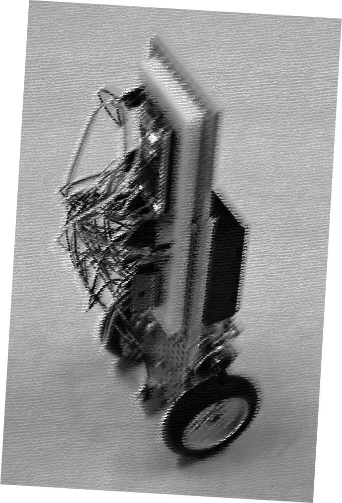
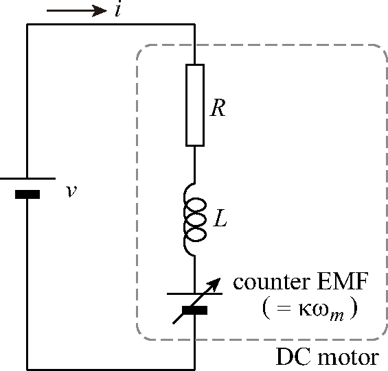

# 演習の目的

:::: wrapfigure
r45mm

::: center

::::

本演習では，自走式倒立振子を（ほぼ）一から製作することを通じて，

- 組み込みマイコンの基本的な使い方

- エンコーダの原理と構造

- センサ信号処理の基礎

- フィードバック制御の基礎

を習得することを目的とします．\
倒立振子（とうりつしんし，inverted pendulum）とは，文字通り「振り子」を倒立させたシステムです．倒立した振り子は不安定ですが，振り子の傾斜に応じてベース部分を動かすことで安定な倒立状態を保つことができます．傾斜に応じてベース部分を動かす，という操作は「フィードバック制御」の典型的な事例であり，倒立振子はそのわかりやすさから制御やメカトロニクスの演習教材として広く用いられています．

倒立振子には，リニアステージ上に振り子を取り付けたタイプと，振り子自体が自走するタイプとがあり，後者が本演習の自走式倒立振子にあたります．自走式倒立振子の原理は，セグウェイに代表される移動装置や，自走式ロボットなどに利用されています．

自走式倒立振子は演習教材キットなども市販されていますが，本演習ではあえてそうしたキットは用いず，[*基礎的なパーツのみを用いて自ら倒立振子を組み上げていくことで，その構成や仕組みをより深く理解することをめざします．*]{style="color: warnRed"}また，フィードバック制御においてはセンサがとても重要になりますが，センサを（よりプリミティブなセンサ素子を使って）自作することにより，[*センサの難しさや重要性を体感してもらいたいと思います*]{style="color: warnRed"}．

# 倒立振子制御の概要

## 倒立振子のモデル

はじめに，自走式倒立振子の制御の概要について考えます． 図[\[fig:model\]](#fig:model)は簡略化した倒立振子のモデルです．タイヤ（質量$m_w$，慣性モーメント$j_w$）の軸から振り子（＝倒立振子の本体，質量$m_p$，慣性モーメント$j_p$）が立っています．タイヤと振り子の間にはモータがあり，モータを駆動すると両者に互いに逆向きのトルク（$\pm\tau$）が生じます．水平方向のタイヤ中心位置を$x$とします．簡単のため地面からタイヤに働く摩擦以外には，摩擦・損失は無いものとします．我々が制御したいのは，倒立振子の角度$\theta$とタイヤ位置$x$（＝本体位置）です．

図[1](#fig:model_disassembled)のように，振り子とタイヤに分けて，それぞれの運動方程式を考えます．まず，振り子の運動方程式は， $$\begin{eqnarray}
\textrm{水平方向} && m_p \frac{d^2}{dt^2}(x+l\sin{\theta})=m_p (\ddot{x}+l\ddot{\theta}\cos{\theta}-l\dot{\theta}^2\sin{\theta}) = H \label{eq:pH}\\
\textrm{鉛直方向} && m_p \frac{d^2}{dt^2}(l\cos{\theta})=-m_p(l\ddot{\theta}\sin{\theta}+l\dot{\theta}^2\cos{\theta})=V-m_p g \label{eq:pV}\\
\textrm{回転方向} && j_p\ddot{\theta}=lV\sin{\theta}-lH\cos{\theta}-\tau \label{eq:pR}
\end{eqnarray}$$ と書き表せます．ただし，$H$と$V$はタイヤと振り子の間に働く力の水平成分と鉛直成分です． 一方，タイヤの運動方程式は， $$\begin{eqnarray}
\textrm{水平方向} && m_w \ddot{x} = F-H \label{eq:wH}\\
\textrm{回転方向} && j_w\ddot{\phi}=\tau -rF \label{eq:wR}
\end{eqnarray}$$ となります（鉛直方向は地面からの抗力と釣り合うだけなので省きました）．ただし，$F$は地面から受ける摩擦力（これによってタイヤが進む）であり，タイヤと地面の間の滑りはない（$x=r\phi$）ものとします．これら一連の式から，内力$H, V$と摩擦力$F$を消去して，振り子角度$\theta$と位置$x$だけで表した式を求めます．

<figure id="fig:model_disassembled" data-latex-placement="tb">

<embed src="model.eps" />

<embed src="model_disassembled.eps" />

<figcaption>各部に働く力とトルク</figcaption>
</figure>

まず，式([\[eq:pH\]](#eq:pH))，([\[eq:pV\]](#eq:pV))から得られる$H,V$を式([\[eq:pR\]](#eq:pR))に代入すると次式が得られます． $$\begin{equation}
j_p\ddot{\theta}=m_p gl \sin{\theta} - m_p l \ddot{x}\cos{\theta} - m_p l^2 \ddot{\theta} -\tau
\label{eq:rotation0}
\end{equation}$$ 次に，式([\[eq:wH\]](#eq:wH))，([\[eq:wR\]](#eq:wR))より$F$を消去し，$H$を求めると， $$\begin{equation}
H = \frac{\tau}{r}-\left( m_w + \frac{j_w}{r^2} \right) \ddot{x}
\end{equation}$$ となりますので，これを式([\[eq:pH\]](#eq:pH))に代入すると， $$\begin{equation}
\frac{\tau}{r} = \left( (m_p+m_w) + \frac{j_w}{r^2} \right)\ddot{x} + m_pl\cos{\theta}\ddot{\theta} - l\sin{\theta}\dot{\theta}^2
\label{eq:horizontal0}
\end{equation}$$

式([\[eq:rotation0\]](#eq:rotation0))，([\[eq:horizontal0\]](#eq:horizontal0))が倒立振子の基本式となりますが，これらの式は非線形項（$\sin$や$\dot{\theta}^2$など）を含んでおり，このままでは扱いにくいため，傾斜角$\theta$が微小であると仮定して線形近似（$\sin{\theta} \simeq \theta$，$\cos{\theta} \simeq 1$, $\dot{\theta}^2 \simeq 0$）します．すると，次の線形微分方程式のペアが得られます．これが倒立振子の線形近似モデルです． $$\begin{eqnarray}
&& (j_p + m_p l^2)\ddot{\theta} = m_p gl\theta - m_pl\ddot{x}-\tau \label{eq:rot}\\
&& \frac{\tau}{r} = \left( (m_p+m_w)+\frac{j_w}{r^2}\right)\ddot{x} + m_pl\ddot{\theta} \label{eq:hor}
\end{eqnarray}$$

## 振り子角度の制御

最終的には振り子の回転角$\theta$と本体位置$x$の両者を同時に制御したいのですが，まずは振り子の回転角$\theta$のみに注目し，$\theta=0$となるように制御する，すなわち，振り子を倒立させることだけを考えます．そのために，式([\[eq:hor\]](#eq:hor))から$\ddot{x}$を求めて式([\[eq:rot\]](#eq:rot))に代入し，$\theta$のみの微分方程式を得ます． $$\begin{equation}
\left(j_p + m_p l^2 \left(1-\frac{m_p}{M}\right) \right)\ddot{\theta} - m_pgl\theta = -\left(1+\frac{m_pl}{Mr}\right)\tau
\end{equation}$$ ただし，$M = m_p + m_w + \frac{j_w}{r^2}$です．係数が複雑なので簡単に置き換えると， $$\begin{equation}
I\ddot{\theta} - m_p gl \theta = -A \tau
\label{eq:simple}
\end{equation}$$ となります．この式が表すものは，図[\[fig:simple_pendulum\]](#fig:simple_pendulum)のように，質量$m_p$，軸周りの慣性モーメント$I$の振り子が固定された軸上に設置され，モータから$A\tau$のトルクを受けている状況と同じです．

図[\[fig:simple_pendulum\]](#fig:simple_pendulum)の振り子の振る舞いについて考えてみます．モータからのトルクが無い（＝制御しない）状態では，上の式([\[eq:simple\]](#eq:simple))は$I \ddot{\theta} = m_pgl\theta$となります．これは，形式的にはバネの式と同じですので，図[\[fig:spring\]](#fig:spring)のバネ・質点系と比べてみましょう．図[\[fig:spring\]](#fig:spring)のバネ・質点系の運動方程式は$m\ddot{x}=-kx$となりますが，この式と比較すると，[**倒立振子はバネ係数が$-m_pgl$のバネ・質点系と等価**]{style="color: warnRed"}であることがわかります．ただし，バネ係数（$-m_pgl$）が負であるため，バネとは真逆の不安定な動作をします（つりあい点から少しでも離れると，さらに離れるように力が働く）．

このように，倒立振子は負のバネ係数を持つために不安定であると解釈できます．そこで，図[2](#fig:stabilize)のように鉛直軸との間にバネをつけてトータルの合成バネ係数（＝もともとの負のバネ係数＋新たにつけた正のバネ係数）を正にすることを考えてみます．合成バネ係数が正になれば，振り子は鉛直軸付近で単振動をするようになるはずです．さらに，ダンパ（＝ダッシュポッド：速度に比例する反力を生じる）もつければ，振動を減衰させて鉛直軸に沿って倒立振子を倒立させることができるはずです．とはいえ，本物のバネとダンパをつける訳には行かないので，バネおよびダンパと等価な働きをフィードバック制御により実現してみましょう．

<figure id="fig:stabilize" data-latex-placement="bhtp">

<embed src="simple_pendulum.eps" />

<embed src="spring.eps" />

<embed src="stabilize.eps" />

<figcaption>バネとダンパによる安定化</figcaption>
</figure>

## PD制御

フィードバック制御により，バネとダンパを仮想的に実現する方法を考えます． バネとダンパが生み出す合力は $K_p \theta + K_d \dot{\theta}$ と書けますので，振り子角度 $\theta$（およびその微分 $\dot{\theta}$）がわかれば，モータが次のようなトルクを発生するようにすればよいことになります． $$\begin{equation}
A\tau = K_p \theta + K_d \dot{\theta}
\label{eq:pd}
\end{equation}$$ これにより，モータがバネ＋ダンパの役割を果たします．

このように，位置や角度（目標値からのずれ）に*比例*した量と，その微分に*比例*した量をフィードバックする制御法を，**PD制御**と呼びます．P は *Proportional*，D は *Derivative* の略です．どちらか一方だけを用いる場合には，それぞれ P 制御（比例制御），D 制御（微分制御）と呼びます．上の説明からわかるように，P 制御はバネに，D 制御はダンパに相当する働きをします．また，それぞれの係数 $K_p, K_d$ は，P ゲイン（比例ゲイン），D ゲイン（微分ゲイン）と呼ばれます．

PD 制御した振り子の運動方程式は，式([\[eq:simple\]](#eq:simple)) と式([\[eq:pd\]](#eq:pd)) より， $$\begin{equation}
I \ddot{\theta} =  - (K_p - m_pgl) \theta - K_d \dot{\theta} = -K \theta - K_d \dot{\theta}
\label{eq:total}
\end{equation}$$ と表せます．ここで，$K = K_p - m_pgl$ は，「重力による負のバネ」と「制御による正のバネ」を合成したときのバネ係数です．この式から，PD 制御された倒立振子は，バネ係数 $K$，減衰係数 $K_d$ のバネ・質点・ダンパ系と同じように運動することがわかります．すなわち，平衡点（$\theta=0$）からずれた角度を初期値として与えると，減衰振動しながら平衡点 $\theta=0$ へ収束します．通常のバネ・質点・ダンパ系と同様に，バネ係数（$\approx$ 比例ゲイン）を大きくすると振動数が上がり，微分ゲインを大きくすると減衰が強くなって振動が速く収まります．

## これだけで倒立できるか？

運がよければ，式([\[eq:pd\]](#eq:pd)) に基づいてモータトルクを制御するだけで倒立を保てるかもしれません．しかし実際には，これだけでは倒立しないことが多くあります（短時間は立っても持続しない）． その主な原因は，傾斜角 $\theta$ を測る傾斜センサのオフセット，および外乱（風や机の振動など，系の外から加わる力）です．

例えば，傾斜センサにわずかなオフセット（出力値のずれ）があると，一見 $\theta=0$ に見えていても，実際にはそのオフセット分だけ傾きが残っています．すると重力により倒立振子は倒れます．これを引き起こして立て直そうとして制御系はモータトルクを増やし，倒立振子は走り始めます．倒れないためには一定加速度で走り続ける必要がありますが，モータ速度には限界があります．モータが速度限界に達するとそれ以上加速できず，結局倒れてしまいます．

これを防ぐには，角度だけを見て制御するのではなく，倒立振子の位置（$\propto$ タイヤの回転量）も検出し，その位置ずれに対する PD 制御を加える必要があります．この点については後であらためて説明します．

## モータのトルク

式([\[eq:pd\]](#eq:pd)) に基づく制御を行うためには，もうひとつ考えておくべきことがあります．それがモータのトルクです．モータを駆動するとき，我々はモータ端子間に電圧を加えます．この電圧を変えればモータの発生トルクも変わりますが，電圧と発生トルクはどのような関係になっているのでしょうか．

:::: wrapfigure
r60mm

::: center

::::

図[\[fig:motor\]](#fig:motor) は DC モータの等価回路モデルです．モータ内部には磁場を作るための巻線があり，そこには抵抗 $R$ とインダクタンス $L$ があります．また，モータには発電機と同じ作用もあるため，回転すると回転速度に比例した電圧が発生し，これを*逆起電力*と呼びます．逆起電力は印加電圧とは逆向きに生じます．

モータトルクは巻線が作る磁場の強さに比例し，磁場の強さは巻線に流れる電流に比例します．したがって，発生トルクは巻線電流に比例します（$\tau=\kappa i$）．この比例係数 $\kappa$ をモータの「トルク定数」と呼びます．

つまり，我々が決めてモータに与えるのは **電圧** ですが，トルクに比例するのは **電流** です．両者が単純に比例していれば話は簡単ですが，実際には逆起電力やコイルのインピーダンスの影響があるため，単純比例にはなりません．そこで両者の関係を求めてみましょう．

図[\[fig:motor\]](#fig:motor) の等価回路から，電流（ラプラス変換して $I(s)$）と印加電圧（同様に $V(s)$）の関係式を導くと， $$\begin{equation}
I(s) = \frac{V(s) - \kappa \Omega_m(s)}{R+sL}
\end{equation}$$ となります．ここで $\kappa$ はトルク定数（＝逆起電力定数）[^2]，$\Omega_m(s)$ はモータ角速度 $\omega_m$ のラプラス変換，$sL$ はインダクタンス $L$ のインピーダンスです．

上式で $sL$ が $R$ に比べて十分小さければ，インダクタンスは無視できます．実際，今回用いる DC モータでは $L$ は十分小さいとみなせるため，ここではインダクタンスを無視します．その場合，モータトルクは（過渡応答を考えないのでラプラス変換を外して） $$\begin{equation}
\tau = \kappa \frac{v- \kappa\omega_m}{R}
\label{eq:motor_simple_equiv}
\end{equation}$$ と簡単に書けます．この式からわかるように，トルクを正しく発生させるには，モータの角速度 $\omega_m$ を求めて，逆起電力成分 $\kappa \omega_m$ を印加電圧に加えてやる必要があります．そのためには回転速度を測るセンサが必要ですが，まだ実際には回転速度を測れないので，当面は逆起電力の存在を無視して進めます．逆起電力を無視すれば，印加電圧と電流，さらにモータトルクは比例関係になります．したがって，式([\[eq:pd\]](#eq:pd)) に従ってモータトルクを計算し，それに比例した電圧をモータに与えれば，少なくとも短時間は倒立できるはずです．

[^2]: 逆起電力と速度の比例係数は通常「逆起電力定数」と呼ばれますが，SI 単位系で揃えると逆起電力定数とトルク定数は同じ値になります．これはエネルギー保存を考えて計算すると確認できます．
