# Week 1: 組立と立ち上げ

## Week 1 の概要と到達目標

Week 1 では，倒立振子のハードウェア基盤を組み立て，立ち上げることに集中します．作業は大きく二つに分かれます． 一つ目は，異なる学生が同時に進められる 3 つの**並列タスク**，二つ目は，回路を段階的に組み立てて確認していく**チームでの立ち上げ作業**です．

**到達目標：**

- 機械系の組立（センサ，モータ，ブレッドボード，電池ボックス）を完了する

- マイコン開発環境を整え，ツールチェーンとシリアルデバッグを確認する

- 実際のブレッドボード配線に着手する前に，Fritzing 上で全配線を設計する

- 回路を 3 段階（モータ $\rightarrow$ 角度センサ $\rightarrow$ 全体統合）で組み立て，段階ごとに確認する

- 写真，Fritzing ファイル，立ち上げ結果などの提出用記録を残す

**並列タスクの推奨分担：** 学生 A（機械），学生 B（マイコン），学生 C（Fritzing／配線設計）．役割は途中で入れ替えても構いませんが，段階ごとの立ち上げと確認には全員が参加してください．

## 電子部品の解説

次に電子回路を組み立てますが，その前に使用する部品について説明します．具体的な回路組立作業はこの Week 1 の後半で説明しますので，まずはここを読んで部品の役割を把握しておいてください．

!!! warning
    - 半導体部品（マイコンなどの IC，LSI）は静電気で壊れやすいので，特に乾燥した時期は端子に素手で触れないよう注意してください．
    
    - *人の身体は帯電しています．* 電子回路の組立前には，ドアや机の金属部分など，大きな導体に触れて身体の電気を逃がしてください．
    
    - 放電後も，作業中に再び帯電しないよう気をつけてください．椅子の上で体をずらしたり，セータを脱いだりするだけでも静電気が発生します．
    
    - 放電した後でも念のため，IC／LSI の端子には直接触れないでください．

### 抵抗とコンデンサの表記（値と極性）

#### 抵抗：抵抗値の見分け方

抵抗値は，テスタ（$\Omega$ レンジ）で実測するか，カラーコードを読んで確認します．正確に測りたい場合は，並列経路の影響を避けるため，*回路から外した状態*（少なくとも片側の足を浮かせた状態）で測るのが望ましいです．\
**4本帯カラーコード（最も一般的）：** 1 本目＝1 桁目，2 本目＝2 桁目，3 本目＝乗数，4 本目＝許容差を表します．\
**数字に対応する色：** 黒=0，茶=1，赤=2，橙=3，黄=4，緑=5，青=6，紫=7，灰=8，白=9 です．

- **例（100$\Omega$，4 本帯）：** **茶--黒--茶** に，許容差として **金**（$\pm 5\%$）または **茶**（$\pm 1\%$）が付くのが一般的です．茶=1，黒=0 なので最初の 2 本で "10"，3 本目の茶は乗数 $\times 10^{1}$ を表すので，$10 \times 10 = 100\,\Omega$ となります．

精密抵抗では 5 本帯の場合もありますが，考え方は同じです（有効数字が増え，最後に乗数と許容差が付く）．\
**数字表記（主にチップ抵抗）：** 抵抗には数字が印字されていることもあります．考え方はコンデンサの 3 桁コードと似ていますが，**単位は $\Omega$** です．一般的な 3 桁コードでは，最初の 2 桁が有効数字，3 桁目がゼロの個数（$\times 10^n$）を表します．例えば **`101`** は $10 \times 10^{1}=100\,\Omega$，**`102`** は $10 \times 10^{2}=1\,\textrm{k}\Omega$ を意味します．

#### コンデンサ：容量表示と極性の見方

小型のバイパスコンデンサの多くは無極性（セラミック，フィルムなど）で，向きを気にせず挿せます．一方，電解コンデンサやタンタルコンデンサは有極性なので，向きを正しく入れる必要があります．

- **代表的な表示：** `0.1u` や `100n` のように値が直接書かれているものもあれば，小型セラミックでは pF 単位の 3 桁コードが用いられることも多いです（最初の 2 桁が有効数字，3 桁目がゼロの個数）．例えば **`104`** は $10 \times 10^{4}\,\mathrm{pF}=100\,\mathrm{nF}=0.1\,\mu\mathrm{F}$ を意味します．

- **有極性と無極性：** セラミック／フィルム系は **無極性**，アルミ電解やタンタルは **有極性** です．一般的なアルミ電解では，本体の帯が **負極** を示し，長い足が **正極** であることが多いです．基板上では `+` 表示が付いていることもあります．

### モータドライバ（DRV8832）

先ほどの説明では，7 行目で p18 に出力した電圧でモータを駆動することを想定していましたが，mbed の出力から取り出せる電流は小さいため，ピンに直接モータをつないでも駆動できません．そこで，大電流を流せるモータドライバ IC を介してモータを駆動します．

今回用いるドライバは Texas Instruments 社の DRV8832 です．チップ単体では小さく扱いにくいため，基板実装済みのもの（AE-DRV8832：秋葉原の秋月電子で販売）を使用します． この基板には 3 本の入力ピンがあり，うち 2 本（IN1, IN2）がモータの回転方向（電圧の符号）を決め，残り 1 本（VSET）が印加電圧の大きさを決めます．回転方向を決める 2 本には mbed のデジタル出力を直接つなぎ，印加電圧を指示するピンには mbed のアナログ出力を接続します．また，電流制限用のピン（ISENSE, pin 2）もありますが，今回は電流制限を使わないので GND（0V，この回路では電池のマイナス側）へ直結します．

モータから出ている 2 本の線はドライバの 1 番ピンと 3 番ピンにつなぎますが，今後の実験ではモータとドライバの接続を何度も抜き差しすることになります．ただし，モータ線は柔らかく，ブレッドボードへの抜き差しがしにくいので，モータ線をドライバに直接つなぐのではなく，別のジャンパ線を介して接続してください．抜き差ししにくいモータ線はブレッドボードに挿したままにし，ジャンパ線だけで着脱できるようにしておくと便利です．

モータドライバの詳細については，回路例 [^3] およびデータシート [^4] を参照してください．

### フォトインタラプタと傾斜センサ

#### フォトインタラプタ

本演習の倒立振子では，すべてのセンサ（傾斜センサ，および後で説明するロータリーエンコーダ）をフォトインタラプタで実現します．フォトインタラプタは非常に安価に入手でき，今回用いるものも秋葉原で 1 個 40 円程度で購入できます．演習の都合上，フォトインタラプタを使った傾斜センサはあらかじめ用意してありますが，後述のロータリーエンコーダは各自で製作してもらいます．

フォトインタラプタは，LED とフォトトランジスタを組み合わせた光学素子です．多くの場合，赤外域の光を用いるため，発光は目には見えません．図[\[fig:interrupter\]](#fig:interrupter) に示すように，フォトインタラプタには反射型と透過型があり，それぞれ反射光または透過光の有無によって物体の有無を検出します．特に反射型では，反射光量が対象物表面の反射率（$\approx$ 色）や対象物までの距離によって変化するため（データシート Fig.7 参照），白黒を見分けるセンサとしてだけでなく，色センサや距離センサとしても利用できます．今回はこの距離センサとしての性質を利用して，傾斜センサを実現しています．（後で説明するロータリーエンコーダでは，スケール表面の白黒パターンを読み取ります．）

フォトインタラプタの基本回路を図[3](#fig:pi_circuit) に示します．まず LED を点灯させる必要があります．データシート [^5] を見ると，順方向電圧 $V_F$（1.2V）と，点灯時の代表電流値（20mA）が示されています． 順方向電圧とは，LED 動作時に LED 両端へかかる電圧降下です．今回は後述の三端子レギュレータの 3.3V を電源電圧（VCC）として使うため，順方向電圧が 1.2V なら，残りの 2.1V を直列抵抗で落とす必要があります．20mA 流したときに 2.1V 落とす抵抗値は，オームの法則より $R=2.1\textrm{V}/20\textrm{mA}=105\Omega$ ですが，$105\Omega$ は一般的でないので，近い値の $100\Omega$ を用います． 抵抗値の読み方（カラーコードやテスタによる測定）については第[3.2.1](#sec:passive_markings)節を参照してください．

<figure id="fig:pi_circuit" data-latex-placement="bht">

<embed src="photo_interrupters.eps" />

<embed src="pi_circuit.eps" />

<figcaption>基本回路</figcaption>
</figure>

絶対最大定格（今回は 50mA）を超える電流が流れると，LED は一瞬で壊れます．したがって，**抵抗を入れずに直接電源へ接続してはいけません**．（配布済みの傾斜センサには，これを防ぐために最初から配線先端へ $100\Omega$ の抵抗が半田付けしてあります．）

受光側のフォトトランジスタでは，エミッタ側に抵抗をつないで電圧を読み取ります（コレクタ側に抵抗を付ける構成でも構いませんが，その場合は出力電圧の極性が逆になります）．光が入るとコレクタ・エミッタ間に電流が流れ，その電流が外付け抵抗を流れることで電圧に変換されます．得られる電圧は概ね入射光量に比例します．外付け抵抗の値は，データシートと実機の状況を見ながら決めます．同じ光量なら抵抗値が大きいほど大きな電圧が得られますが，出力は電源電圧を超えられないので，飽和しないよう適切な値を選んでください．

フォトインタラプタの LED は赤外光で目に見えないため，本当に点灯しているのか不安になるかもしれません．そのようなときは，スマートフォンや PC のカメラで LED を見てみましょう．紫っぽく光って見えるはずです．ただし，機種によってはカメラ部に赤外カットフィルタが入っており，赤外 LED が見えないことがあります．その場合は前面カメラも試してください．前面カメラは赤外をあまりカットしていないことが多いです．自分のスマートフォンに赤外カットフィルタがあるか調べたい場合は，テレビのリモコン送信部をカメラで見てみるとわかります．フィルタが無ければ，ボタンを押したときにかなり強く光って見えるはずです（今回のフォトインタラプタはそれよりかなり暗いです）．

#### 傾斜センサ

倒立振子の傾斜角測定にはジャイロセンサがよく使われますが，ジャイロセンサが直接測っているのは角速度であり，角度を求めるには積分が必要です（その際，ドリフトの問題があります）．今回は，より直接的に角度を得るためにフォトインタラプタを用います．

倒立振子の底面には，すでに傾斜センサが取り付けられているはずです．この傾斜センサは 2 個のフォトインタラプタから構成されており，機体前後のフォトインタラプタが床面までの距離（反射光量）をそれぞれ測り，その差分を角度として出力します．

したがって，測っているのは鉛直面に対する角度ではなく，床面に対する角度です．そのため，床の傾きが変わると，鉛直基準で見たときのセンサ出力には誤差が生じます．

また，床面の反射率が変わるとセンサ感度も変化します．反射率の高い（明るい）床面では，傾斜が大きめに出る傾向があります．ただし，ここでいう明るさは赤外域での明るさなので，可視光で見た明るさと一致するとは限りません．

### 三端子レギュレータ

今回は倒立振子全体の電源として電池を用いますが，電池から大電流を取り出すと，内部抵抗のために電圧が低下します．この回路ではモータ駆動に伴って大きな電流が流れるため，電池電圧はモータの動作に応じて大きく変動します． この変動した電圧でフォトインタラプタを駆動すると，センサ出力に大きなノイズが重畳してしまいます．そこで，フォトインタラプタ用の電圧は三端子レギュレータで安定化します．

三端子レギュレータは，変動する電圧を入力し，それより低い一定電圧を出力する IC です．三端子レギュレータにはさまざまな型番がありますが，基本的には型番末尾の数字が出力電圧を表します．今回は LD33（正確には LD1117V33） [^6] を使用します．出力電圧は 3.3V です．フォトインタラプタ関連の電圧はすべてこの三端子レギュレータの出力を用いてください．一方で，モータ用電源とフォトインタラプタ用電源は分離したいので，***モータドライバの電源は三端子レギュレータからではなく，電池から直接**取ってください．*

実は mbed 基板上にも 3.3V の三端子レギュレータ（LD33 と書かれたチップ）が載っており，右上の VOUT ピンから安定化された 3.3V が出ています（図[9](#fig:mbed_pin) 参照）．この電圧を使ってもよいのですが，今回のブレッドボード配置ではこのピンにアクセスしづらいため，別途レギュレータを取り付けることにします．

## 並列で進める組立作業

以下の 3 つの作業は並列に進めることができます．各作業の成果は，後半のチームによる回路組立と立ち上げで利用します．

### Task A：機械組立（学生A）

制御の概要がつかめたところで，倒立振子の組立を見ていきます．**（実際の組立は演習当日に行いますが，あらかじめ一通り目を通しておいてください．）**[^7] ここで用いる部品は以下の通りです[^8]．（電気系部品はこの Week 1 内で別途説明するため除いてあります．）

1.  ユニバーサルボード（加工済み）＋車輪

2.  ユニバーサルボード＋ブレッドボード＋mbed LPC1768

3.  DC モータ（Mabuchi Motor RE-280RA） [^9]（先端にゴムローラ取り付け済み）

4.  モータブラケット

5.  電池ボックス（単 3 充電池 4 本）

6.  傾斜センサ（本演習用の専用部品）

7.  L 字金具

車輪付きユニバーサルボード（No.1）が組立の中心になります．以下，このボードに各部品を取り付けていきます．

#### 傾斜センサの取り付け

まず，傾斜センサ（No.6）を車輪付きユニバーサルボード（No.1）の下面に取り付けます．図[\[fig:angle_sensor\]](#fig:angle_sensor) のように，L 字金具（No.7）を用いて固定してください．

<figure id="fig:machine" data-latex-placement="b">

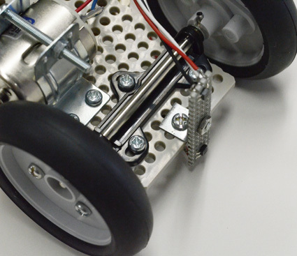

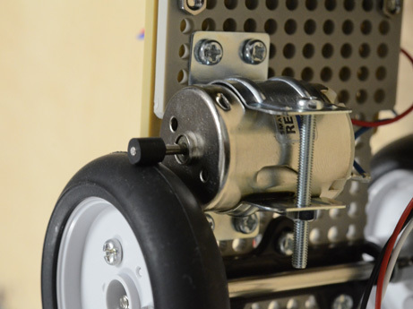

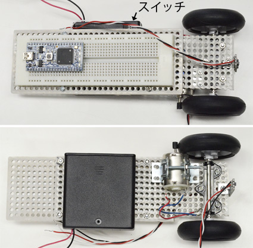

<figcaption>完成イメージ</figcaption>
</figure>

#### DC モータの取り付け

次に DC モータ（No.3）を取り付けます．モータブラケット（No.4）を用いて，ユニバーサルボード（No.1）の車軸と同じ面に固定してください（図[\[fig:motor_setup\]](#fig:motor_setup) 参照）．ブラケット固定用のねじは少し小さい M2 ねじです．頭が小さく，付属ドライバでは回しにくいことがありますが，緩まないようしっかり締めてください．

DC モータを固定する際は，ゴムローラがタイヤへ「軽く触れる」ように調整してください． ***強く押し付けすぎると駆動できなくなるので，軽く接する程度が重要です．*** ただし，タイヤは完全な真円ではないため，軽すぎると回転位置によってスリップすることがあります．タイヤを一周回し，どの位置でもローラが接触していることを確認してください．

#### ブレッドボードの取り付け

ブレッドボードが載った No.2 のユニバーサルボードを，No.1 のユニバーサルボードへねじ止めします．No.2 側にはあらかじめボルトが立っているはずです．後で再装着しにくいので，ボルト自体は外さないでください（取付時にナットだけ着脱します）．No.1 側にはモータ固定用のねじもあるため，それらと干渉しない位置を選んでください．無理に重なった状態で締めると基板が割れます．次に電池ボックスも載せるので，その位置も考慮して配置を決めてください．

mbed はすでにブレッドボードへ挿してあるはずです．USB ポートが上側に来る向きで取り付けてください．*mbed をブレッドボードから無理に抜くとピンが折れるので，外さないでください．*

#### 電池ボックスの取り付け

最後に，電池ボックス（No.5）を両面テープで No.1 のユニバーサルボードへ固定します． 電池ボックスは最も重い部品なので，取り付け位置によって倒立振子の特性が変わります． 空いている場所ならどこに貼っても構いませんが，前後方向には注意してください．ふた側へテープを貼ると開閉できなくなります．また，背面スイッチに手が届く向きで貼るようにしてください．

両面テープは思った以上に強力です．大量に貼ると剥がせなくなるため，上下に 5cm 程度ずつ貼れば十分です．

ここまでで基本的な機械構造は完成です．完成例を図[4](#fig:machine) に示します．

### Task B：マイコンのセットアップ（学生B）

今回使うマイコンは mbed[^10] です． mbed の特徴は，C/C++ による開発環境がクラウド上に用意されており，サインアップすればすぐに開発を始められることです．また，プログラム書き込みも USB 接続した mbed が USB ドライブとして見えるため，コンパイルしたファイルをコピーするだけで済みます． mbed シリーズには複数の基板がありますが，今回は標準的な LPC1768 を用います．

#### Keil Studio Cloud の準備

まず，Keil Studio Cloud[^11] へアクセスし，アカウントを作成してください． サインアップ後，付属 USB ケーブルでマイコンを PC に接続します．PC からは USB ドライブとして認識されます． コンパイラ画面左上の Build Target には，**mbed LPC1768** が選択されていることを確認してください．

#### サンプルプログラムのコンパイル

コンパイラ画面のメニューから「File」$\rightarrow$「New Project」を選び，mbed_blinky をひな形にした新しいプログラムを作成します（図[8](#fig:keil_interface)）．具体的には Example Project の下部にある **Mbed2-example-blink** を選び，Project Name を適当に設定してください．LED を点滅させるコードが入った新規プログラムが作られるので，まずはそのままコンパイルします．コンパイルはハンマ形のアイコンから実行できます．完了すると実行ファイル（拡張子 `.bin`）がダウンロードされるので，これを mbed の USB ドライブへドラッグ＆ドロップで書き込みます．

<figure id="fig:keil_interface" data-latex-placement="h">
<figure id="fig:keil_new">
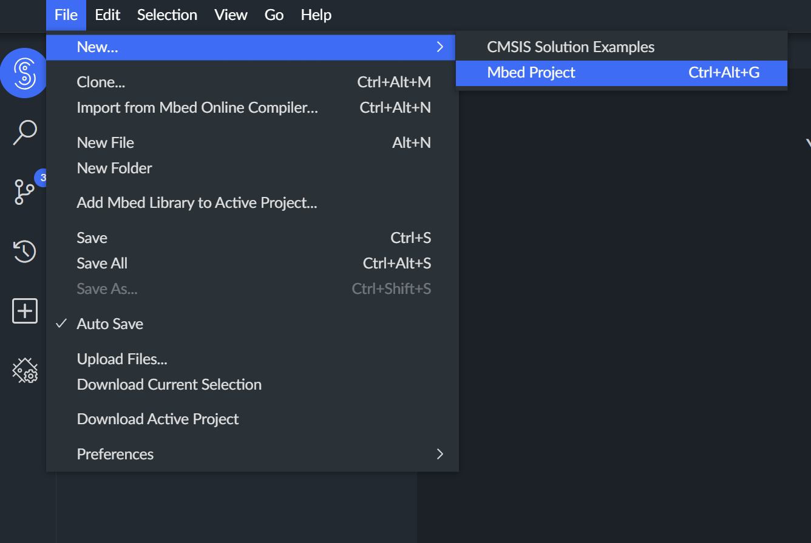
<figcaption>新規プロジェクト作成</figcaption>
</figure>
<figure id="fig:keil_template">
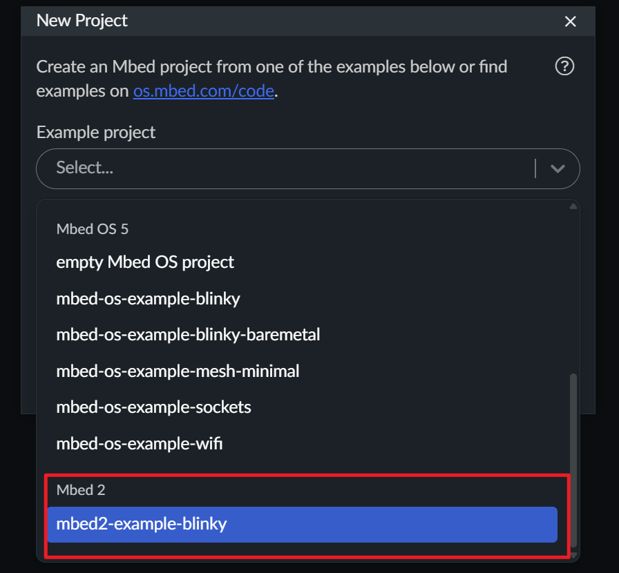
<figcaption>サンプルテンプレート選択</figcaption>
</figure>
<figure id="fig:keil_compile">
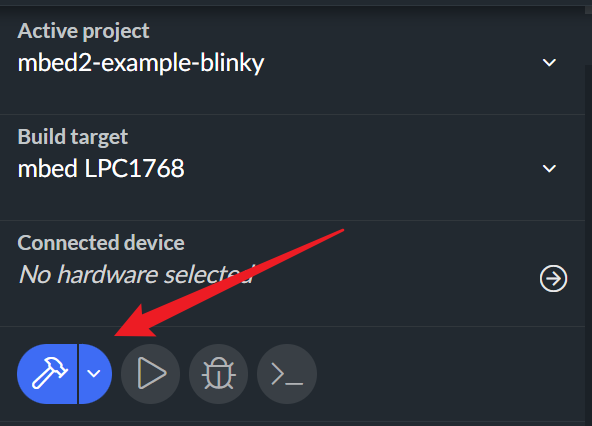
<figcaption>コンパイルボタン</figcaption>
</figure>
<figcaption>Keil Studio Cloud によるプロジェクト作成とコンパイル</figcaption>
</figure>

書き込み後，マイコン基板中央のボタン（リセットスイッチ）を押してください．USB ドライブ中で最後に書き込まれたファイルが実行されます．

サンプルプログラムでは，mbed 基板下部に並んだ 4 個の LED のうち左端が点滅すれば成功です．うまくいったら，点滅周期を変えるなど `main.cpp` を少し書き換え，Compile $\rightarrow$ Run の流れに慣れてください．

Mac では上記手順がうまく動かないことがあります．その場合は「Write Error and Countermeasures on macOS」を参照してください．

#### ピン機能の見方

今回用いるマイコン基板には，さまざまな入出力機能があります．例えば，デジタル信号 I/O が 26 チャンネル，内蔵 DA コンバータによるアナログ出力が 1 チャンネル，AD コンバータによる電圧入力が 6 チャンネルあります．さらに PWM（Pulse Width Modulation）出力などもありますが，これらをすべて別々のピンに割り当てると，基板が巨大になってしまいます．

一般にはこれらの機能を同時に全部使うわけではないので，この基板（および一般的なマイコン）では 1 本のピンに複数機能が割り当てられており，必要に応じてプログラムから切り替えて使います．この対応関係を示したのが図[9](#fig:mbed_pin) です．

<figure id="fig:mbed_pin" data-latex-placement="h">

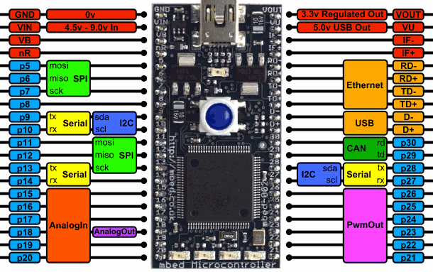

<figcaption>mbed LPC1768 のピン配置（https://os.mbed.com/platforms/mbed-LPC1768/）</figcaption>
</figure>

ユーザが信号 I/O に使えるのは，左右最外列に並ぶ "pXX"（XX は数字）と書かれた 26 本のピンです．これらはすべてデジタル信号の入出力に使え，さらにプログラムで指定することでピン名の横に書かれた機能を利用できます． 例えば左下の p18 を見ると，AnalogIn と AnalogOut の機能が割り当てられています．つまり，このピンにはデジタル入力，デジタル出力，アナログ入力，アナログ出力の 4 機能が割り当てられていることになります．このうちアナログ出力を使いたい場合には，プログラム中で

    AnalogOut aaa(p18);

のように宣言します．これにより p18 の機能として AnalogOut が選択されます．宣言したオブジェクト（上の例では `aaa`）は変数のように書き込みできます（AnalogIn の場合は読み取りもできます）．例えば，

    aaa = 0.5;

とすると，フルスケール（3.3V）の 0.5 倍，すなわち 1.65V のアナログ電圧が p18 から出力されます． 逆に，このピンをアナログ入力として使う場合は，

    AnalogIn aaa(p18);
    ... (omitted)
    b = aaa;

のようにして，宣言したオブジェクト `aaa` を通して p18 に入力された電圧値（フルスケール 3.3V に対する比）を読み取れます（この例では変数 `b` に入る）．

詳細は次のリファレンスマニュアルを参照してください．

    https://os.mbed.com/handbook/Homepage

#### 制御プログラムの基本

フィードバック制御プログラムでは，次の処理を繰り返します．

- センサ信号の読み取り

- 制御計算

- 計算結果の出力

'for' ループや 'while' ループでも繰り返しは書けますが，その場合，繰り返し時間が正確にはわからず，さらに 'if' などの条件分岐があると処理内容によって周期が変わってしまいます．

フィードバック制御やディジタル信号処理では，繰り返し時間（サンプリング時間）が既知で一定であることが重要です．そのため，一般にはタイマを使って時間管理を行います．タイマを使う方法には，タイマ割り込みを使う方法やスレッドを使う方法がありますが，今回はタイマ割り込みを使います． 簡単なプログラム例を以下に示します（左の数字は説明用の行番号です）．

    ------------------------------------------------------------------------
     1:   AnalogIn ad(p20);
     2:   AnalogOut da(p18);
     3:  
     4:   void int0() {
     5:        theta = ad;                     // Reading sensor signal
     6:        command = theta * Kp;           // Control calculation
     7:        da = command;                   // Output
     8:   }
     9:   
    10:   int main() {
    11:        t_int.attach(&int0, 0.001);     // Start timer interrupt
    12:        while(1);                       // Infinite loop as nothing else to do
    13:   }
    ------------------------------------------------------------------------

ここでは P 制御を例に，プログラム主要部を示しています．C 言語のプログラムは 10 行目の `main` 関数から実行されますが，11 行目でタイマ割り込みを設定すると（ここでは 0.001 秒ごとに `int0()` を呼ぶ設定），その後は `main` が終わらないよう 12 行目で無限ループに入ります．

一方，4 行目から始まる `int0()` 関数が，タイマ割り込みで周期実行される制御本体です．この例では，5 行目で外部からのセンサ信号を読み，6 行目で P 制御を計算し，7 行目で外部へ電圧を出力しています． タイマからの割り込み信号が来るたびにこの関数が実行され，結果として（この例では）1ms 周期の繰り返し処理が実現されます．

割り込み処理関数は，必ず割り込み周期内（この例では 1ms）に終わらなければなりません．周期内に終わらないと次の割り込みが入って処理が破綻します．そのため，割り込み処理内では時間のかかる処理を避けるのが鉄則です．特に注意すべきなのが関数呼び出しです．

関数呼び出しはプログラム上では 1 行で書けるため，つい短時間で終わるように見えますが，中には実行時間が意外に長いものがあります．そうした関数を割り込み処理内で安易に呼ぶと，処理が間に合わなくなります．具体的には，'sprintf()' のような文字列処理，'malloc()' のようなメモリ処理，'sin()' のような数学関数は比較的重く，トラブルの原因になりやすいです．

また，*関数呼び出し自体にも処理オーバーヘッドがあるため，自前の関数を過剰に定義・呼び出しするのは避けた方が安全です．*プログラムの見通しを良くするために複数の処理をひとつの関数にまとめるアイデアもありますが，そのような場合は可能ならインライン関数やマクロ定義を使う方が望ましいです（呼び出し時のオーバーヘッドがありません）．

#### シリアル通信とデバッグ

シリアル通信（UART）は，マイコンプログラムの開発において最も重要なデバッグ手段のひとつです．mbed LPC1768 は USB-to-Serial 機能を内蔵しており，プログラムからデバッグメッセージを PC へ送信できます．制御プログラムのデバッグ時には，制御ループを止めることなくリアルタイムで変数値やプログラムの動作を監視できるため，特に便利です．

**UART 通信の原理：** UART（Universal Asynchronous Receiver-Transmitter）は，1 本のワイヤでデータを 1 ビットずつ送受信するハードウェア通信プロトコルです．共有クロックを必要とする同期プロトコルとは異なり，UART は非同期方式であり，送信側と受信側の両方があらかじめ通信速度（ボーレート）に合意しておく必要があります．各バイトのデータは，(1) スタートビット（ロー），(2) 8 ビットデータ（LSB ファースト），(3) オプションのパリティビット，(4) 1 本以上のストップビット（ハイ），から成るフレームとして送信されます．mbed LPC1768 は内蔵の USB-to-Serial コンバータチップを備えており，UART インタフェース（USBTX/USBRX ピン）を USB に橋渡しするため，外部ハードウェアなしに PC と通信できます．

プログラムでシリアル通信を使うには，USB インタフェースに接続された USBTX ピンと USBRX ピンで Serial オブジェクトを作成します．簡単な例を示します．

    Serial pc(USBTX, USBRX);

    int main() {
        pc.baud(9600);  // Set baud rate to 9600 bps
        pc.printf("Hello, World!\n");
        
        while(1) {
            pc.printf("Counter: %d\n", counter);
            wait(1.0);
        }
    }

ボーレートは通信速度を表し，ターミナルソフト側の設定と一致していなければなりません．よく使う値は 9600 bps（安定していて初心者向き）や 115200 bps（高速でデバッグによく使う）です．ほかにも 4800，19200，38400，57600 bps などの標準値があります．

mbed を USB 接続すると，PC 上でシリアルポートとして認識されます（Windows では COM3 など，macOS では /dev/tty.usbmodem\*，Linux では /dev/ttyACM\* などが典型的です）．シリアルメッセージを表示する方法はいくつかあります．最も手軽なのは Keil Studio Cloud の内蔵シリアルモニタを使う方法で，追加ソフトなしにブラウザ上で出力を確認できます．あるいは，Windows では Tera Term や PuTTY，macOS/Linux では screen コマンドや CoolTerm などの従来のターミナルソフトも使えます．Arduino IDE のシリアルモニタも全プラットフォームで動作します．

**専用デバッグツール：** ディレクトリ[^12]には 3 つの専用デバッグツールが用意されており，各ツールは 3 種類のファイルで構成されています．

- **.cpp ファイル**: mbed マイコン用プログラム（C++ ソースコード）．コードを読んで動作を理解したり，必要に応じて変更したりできます．

- **.bin ファイル**: mbed LPC1768 へ直接書き込める事前コンパイル済みバイナリ．mbed の USB ドライブへドラッグ＆ドロップするだけでプログラムできます（コンパイル不要）．

- **.pde ファイル**: PC 上で動作する Processing[^13] 可視化プログラム．mbed からシリアル通信で受信したデータをリアルタイムに表示するグラフィカルなインタフェースを提供します．

各ツールの使い方：(1) `.bin` ファイルを mbed の USB ドライブへコピーして書き込む，(2) mbed のリセットボタンを押す，(3) 対応する `.pde` ファイルを Processing で実行する．mbed のプログラムを変更したい場合は，Keil Studio Cloud で `.cpp` ファイルを編集し，コンパイルして新しい `.bin` ファイルを生成し，mbed に書き込みます．各ツールはフレームベースのシリアルプロトコル（ヘッダバイト 0xAA 0x55）を使用して複数の値を確実に送信し，mbed と PC 表示側の同期を保っています．各ツールの詳細な説明，ピン配置，通信プロトコル，トラブルシューティングについては， ディレクトリ内の `README.md` を参照してください．

シリアル通信は制御プログラムのデバッグに非常に役立ちます．計算を検証するために変数値を出力したり，タイムスタンプを出力して制御ループのタイミングを監視したり，センサ生データを表示して読み取りを確認したり，重要な実行ポイントにメッセージを追加してプログラムフローを確認したりできます．例えば，

    pc.printf("Angle: %f, Motor: %f\n", theta, motor_output);

ただし，割り込み処理関数内で printf を使う場合は注意が必要です．処理時間が長くなってタイミングの厳しい制御ループを乱す可能性があります．タイミング精度が重要なデバッグには，デジタル出力ピンをトグルしてオシロスコープで観測する方法を検討してください．シリアル通信の詳細は，mbed Serial API のドキュメントを参照してください．

### Task C：ブレッドボード配線設計（学生C）

#### ブレッドボードの使い方

ブレッドボードは電子回路の試作によく使われる基板で，半田付け不要で簡単に回路を組めます．図[\[fig:breadboard\]](#fig:breadboard) にブレッドボードの概略を示します．ブレッドボードでは横一列に並んだ 5 個のホールが電気的につながっており，これを利用して配線します．左右の 5 個ずつのホールは互いに独立しています．

<figure id="fig:breadboard_sample" data-latex-placement="hbt">

<embed src="breadboard.eps" />

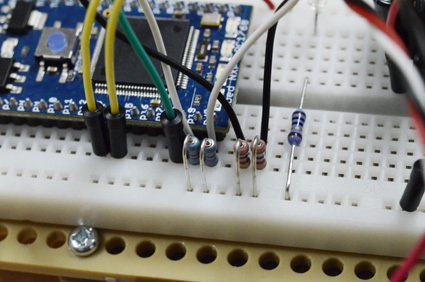

<figcaption>配線例</figcaption>
</figure>

例えば，mbed はすでにブレッドボードに挿してあるはずです．mbed のピンに何かをつなぐには，そのピンのすぐ隣のホールにリード線や抵抗の足を挿すだけです（図[10](#fig:breadboard_sample) 参照）．

また，ブレッドボードには電源電圧用のラインが用意されています．ボード両端の縦一列に並んだホールは，それぞれ縦方向に電気的につながっています．左右に 1 列ずつあるので，それぞれ GND と 3.3V として使ってください．そのため，三端子レギュレータの出力ピン（3.3V）を右の列の任意のホールにリード線でつないでください．同様に，左の列を GND（電池から来る黒線）につないでください．

#### Fritzing による回路設計

ブレッドボードの配線は視覚的に複雑になりやすくミスも生じやすいため，実際のブレッドボードに着手する前に，Fritzing[^14] で回路を設計することをお勧めします．Fritzing はブレッドボードを使ったプロトタイピング向けに設計された無料のオープンソース電子設計自動化（EDA）ツールで，**Breadboard**（ブレッドボード），**Schematic**（回路図），**PCB** の各ビューを連動して提供します．

本演習では，*マイコン*，*モータドライバ*，*フォトリフレクタ* の各モジュール用の専用 Fritzing パーツを用意しています．これらのパーツは，**まず Fritzing にインポートしてから** パーツライブラリに配置してください．

図 [13](#fig:fritzing_setup_and_examples) に本演習の回路設計例を示します．パーツ配置と配線を始める前に，Fritzing の *View* メニューから *Align to Grid* のチェックを外してください；グリッドへのスナップは本設定での配置・配線には不便です．また，**モータドライバ部分をあらかじめ配線した** 設計例も用意しています（図 [11](#fig:fritzing_motor_driver_schematic) および図 [12](#fig:fritzing_motor_driver_breadboard)）．これを参考にし，詳細な部品一覧と手順は Week 1 の回路組立節を参照してください．Fritzing を使うかどうかに関わらず参照できる完全な回路例も付録[^15]に掲載しています．

<figure id="fig:fritzing_setup_and_examples" data-latex-placement="htbp">
<figure id="fig:fritzing_motor_driver_schematic">
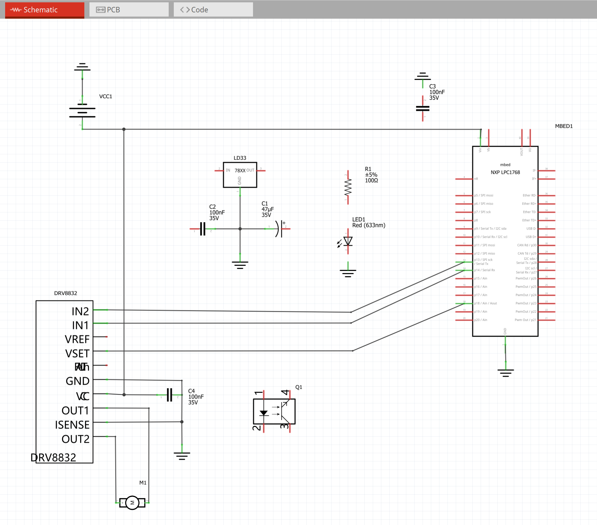
<figcaption><em>Schematic View</em>（回路図）での例．</figcaption>
</figure>
<figure id="fig:fritzing_motor_driver_breadboard">
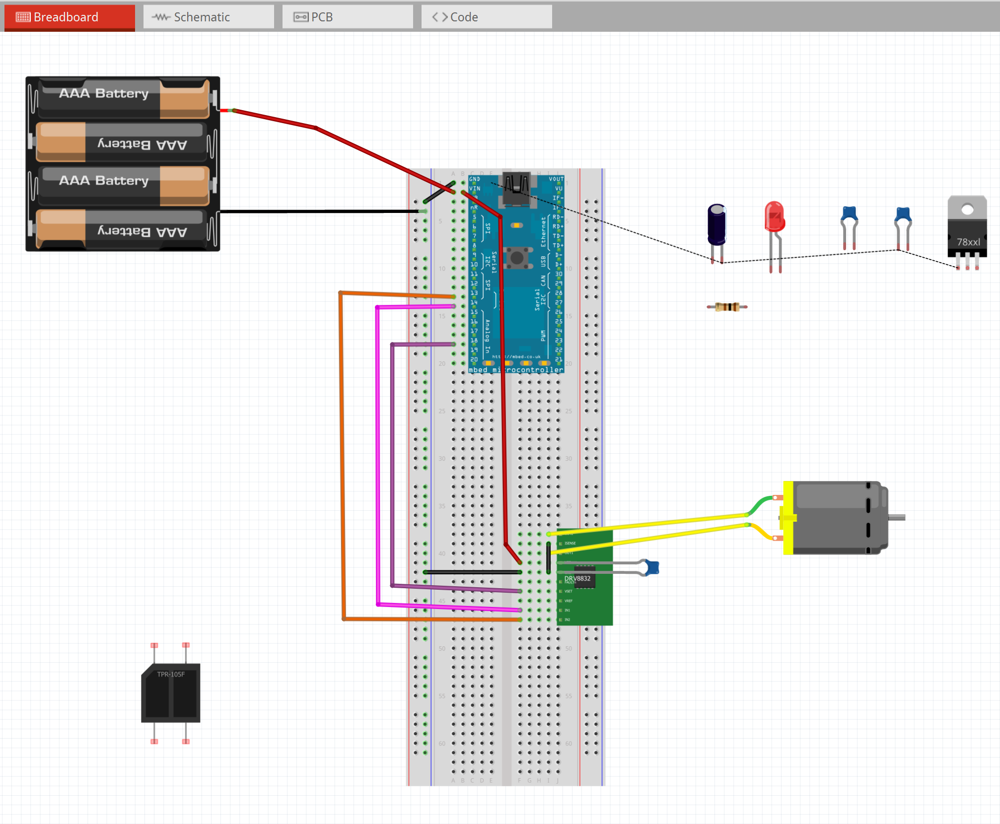
<figcaption>対応する <em>Breadboard View</em>（ブレッドボード）での配線例．</figcaption>
</figure>
<figcaption>本演習の Fritzing 回路設計例．</figcaption>
</figure>

Fritzing を使う際は，まず用意されたすべての専用パーツをインポートし，新しいスケッチを作成して **パネルへ搭載するすべてのモジュール**（マイコン，モータドライバ，フォトリフレクタ，レギュレータ，電池コネクタなど）を配置してください．

次に Schematic View を使って，**どのピン同士を接続すべきか** を確認し，接続漏れがないかを洗い出します．そのうえで，同じ電気的接続を Breadboard View に反映してください．物理的な配置は多少違っても構いませんが，電気的接続は一致している必要があります．配線時は見やすさを優先し，できるだけ短く，不要な交差を避け，機能ごと（電源，モータ，センサ，エンコーダ）にまとめてください．そうすると実機の配線が速くなり，デバッグ時間も減ります．

実際のブレッドボードへ移る前に，Fritzing 上で **電源（3.3V/GND）**，**モータドライバの入出力**，**センサ信号線** に関係するすべてのネットを最終確認し，各信号が想定したマイコンピンへつながっていることを確認してください．特に，**ブレッドボードへ着手する前に Fritzing 上で回路全体を完成させる** ことを徹底してください．

### 合流ポイント（全員）

チームで回路組立を始める前に，以下を確認してください．

- 機械系の組立が完了し，モータローラの接触も適切に調整されている

- マイコンへプログラムを書き込め，シリアル通信も確認できている

- Fritzing 設計に **必要な全モジュール** が含まれ，必要な配線がすべて確認済みである

## 回路組立（チーム作業）

この部分はチーム全員で行います．ミスのリスクを下げ，デバッグしやすくするために，回路は 3 段階で組み立て・確認します．

### 安全上の注意

!!! warning
    - 電源スイッチを入れる前に，せめて電源回りの配線に間違いがないかよく確認してください！
    
    - 電源回りの配線に間違いがあった場合（プラスとマイナスを逆につなぐ，ショートさせるなど），*スイッチを入れた瞬間に回路が壊れます*．
    
    - スイッチを入れて様子を見るのは危険なので，当たって砕けろではなくしっかり確認してから試してください．特に，*マイコン・モータドライバへの電源接続*と*電解コンデンサの極性*に注意してください．
    
    - 配線を変更する際は必ず電源を切ってください．通電中のブレッドボードでリード線を動かすのは禁止です．
    
    - モータ用電源（電池）とセンサ用電源（3.3V レギュレータ）は指示通りに分離してください．

**半田付けと導通確認．** 回路組立の際，半田ごてを使って抵抗やデュポンケーブル（またはリード線）を半田付けし，確実な接続を作ります．通電する前に，テスタの導通モード（ブザーモード）で確認することができます．

!!! warning
    - 使用後は半田ごてのプラグを抜き，片付けたり作業台を離れたりする前に冷えるのを待ってください．
    
    - 通電したままの半田ごてをその場に放置しないでください．

### 組立方針（3段階）

ミスのリスクを下げ，デバッグしやすくするために，3 段階に分けて回路を組み立て・確認することをお勧めします[^16]．

1.  **モータドライバとモータの確認** --- モータ制御（正転・逆転と速度制御）を検証する

2.  **傾斜センサの確認** --- センサ信号の取得と処理を検証する

3.  **全体回路の統合** --- すべての部品を統合して最終的な制御系を完成させる

このように段階を分けることで，回路が複雑になりすぎる前に問題を見つけて修正できます．各段階には，動作確認のためのサンプルプログラムとデバッグツールが用意されています．

### Stage 1：モータドライバとモータの確認

#### 目標

最初の段階では，電源回路，モータドライバ（DRV8832），モータを組みます．mbed の PWM 信号で，モータの回転方向（正転・逆転）と速度を制御できることを確認するのが目標です．

#### Stage 1 で使用する部品

- mbed LPC1768 マイコン

- 電池ボックス（単 3 電池 4 本，6V）

- 三端子レギュレータ（LD1117V33）3.3V 用

- モータドライバ IC（DRV8832）

- DC モータ（RE-280RA）

- バイパスコンデンサ（電源安定化用セラミックコンデンサ）

- レギュレータ用電解コンデンサ

- ジャンパ線

*注：部品番号，仕様，個数の詳細は Appendix [\[app:partslist\]](#app:partslist) を参照してください．*

#### 配線手順

サンプル回路図[^17]のモータドライバ部分に従って回路を配線してください．重要なポイントは次の通りです．

- サンプル回路図では，mbed とモータドライバの電源ピン---GND 間にコンデンサが入っています．これをバイパスコンデンサ（デカップリングコンデンサ）と呼び，抵抗成分のある配線での電圧降下による電源変動を吸収して IC の動作を安定させる役割があります．*バイパスコンデンサは電源ピンのすぐ隣（隣接ホール）に取り付けるのが鉄則です*．回路図上では同じでも，離れた位置に付けるとバイパスコンデンサの効果がなくなります．

- 同様に，*三端子レギュレータにつなぐコンデンサも直近のホールへ取り付けてください*．

- 三端子レギュレータの出力（3.3V）をブレッドボードの縦方向電源ラインの一方へつないでください

- GND（電池の黒線）をもう一方の縦方向電源ラインへつないでください

- *電解コンデンサの極性*（帯が負極側）に十分注意してください

- コンデンサの表記（`0.1u`/`104` など）と有極性・無極性の見分け方については第[3.2.1](#sec:passive_markings)節を参照してください．

- 電源スイッチを入れる前に，すべての電源回りの接続を再確認してください

#### サンプルプログラムとデバッグツール

モータ制御確認用のサンプルプログラム（）を用意しています．このプログラムでは次の項目を試せます．

- 各速度でのモータ正転

- 各速度でのモータ逆転

- モータの停止とブレーキ

制御信号を可視化して動作を確認するために，**デバッグツール 1：Motor Controller**（ に収録）を用意しています．このツールの構成は次の通りです．

- **1_motor_controller.cpp**: シリアル経由（115200 baud）でテキストコマンドを受信する mbed プログラム．コマンド：`F xx`（xx% デューティで正転），`B xx`（xx% で逆転），`S`（停止）．使用ピン：p13（正転），p14（逆転），p18（PWM 電圧）．

- **1_motor_controller.bin**: 事前コンパイル済みバイナリ―mbed の USB ドライブへドラッグ＆ドロップするだけで書き込めます．

- **1_motor_controller.pde**: スライダとボタンを備えた Processing GUI で，コードを変更せずにモータの速度と方向をインタラクティブに制御できます．

Processing GUI では，PWM duty，比較方向（正転／逆転），必要に応じてモータ電流などをリアルタイムで確認できます．制御アルゴリズムへ統合する前に，モータドライバ回路を十分に確認してください．

#### 確認チェックリスト

Stage 2 へ進む前に，次を確認してください．

- 指令通りにモータが正転する

- 指令通りにモータが逆転する

- PWM デューティサイクルに応じてモータ速度がスムーズに変化する

- 指令通りにモータが完全に停止する

- モータドライバ IC の異常な発熱がない

- 電源電圧が安定している（テスタで測定）

### Stage 2：傾斜センサの確認

#### 目標

この段階では，角度センサ（フォトインタラプタ，必要に応じてロータリーエンコーダ）を回路へ追加し，振り子角度を正しく読み取れることを確認します．これは倒立振子制御において最も重要なセンサです．

#### Stage 2 で追加する部品

- フォトインタラプタセンサ（TPR-105F）$\times$ 2

- センサ出力用プルアップ抵抗

- センサ接続用の追加ジャンパ線

#### 配線手順

サンプル回路図[^18]のセンサ部分に従って，既存のモータドライバ回路へセンサ回路を追加してください．重要なポイントは次の通りです．

- センサの電源は 3.3V ラインへつなぐ（5V 不可：mbed の入力は 3.3V ロジック）

- センサ出力ラインに適切なプルアップ抵抗を取り付ける

- ノイズを最小限にするため，センサ信号線をモータ電源線から離してまとめる

- センサをエンコーダディスクやスリットパターンと機械的に正しく位置合わせする

#### サンプルプログラムとデバッグツール

センサ信号の読み取りと処理を確認するサンプルプログラム（）を用意しています．このプログラムで確認できるのは次の項目です．

- デジタルセンサ出力の読み取り

- センサ読み取り値からの角度計算

- 微分による角速度の計算

- ノイズ低減のためのフィルタリング

**デバッグツール 2：Analog Input Visualizer**（ に収録）は，4 チャンネルのアナログ入力をリアルタイム表示します．

- **2_analog_input_visualizer.cpp**: 約 200 Hz で 4 チャンネルのアナログ入力を読み取り，フレームベースプロトコル（ヘッダ：0xAA 0x55，続いて 4 データバイト）でシリアル（115200 baud）送信する mbed プログラム．ピン：p16（CH1），p17（CH2），p19（CH3，通常フォトインタラプタ 1），p20（CH4，通常フォトインタラプタ 2）．4 チャンネルは，傾斜センサ，エンコーダ信号，ポテンショメータなど，任意のアナログセンサに使用できます．

- **2_analog_input_visualizer.bin**: mbed に書き込める事前コンパイル済みバイナリ．

- **2_analog_input_visualizer.pde**: 4 チャンネルのリアルタイム波形を表示する Processing プログラム．フォトインタラプタ使用時は振り子角度と角速度の計算，ロータリーエンコーダ使用時は CH1/CH2 でエンコーダ信号の表示ができます．

このツールは，センサの動作確認，機械的な不具合の検出，信号品質の確認に有用です．角度センサなら振り子を手で動かしながら出力を見られますし，エンコーダなら車輪を回して 2 相波形を確認できます．ヘッダ付きフレーム形式にしているため，mbed と PC 表示側の同期も安定します．

<figure id="fig:debugtools12" data-latex-placement="htbp">
<figure id="fig:debuger1">
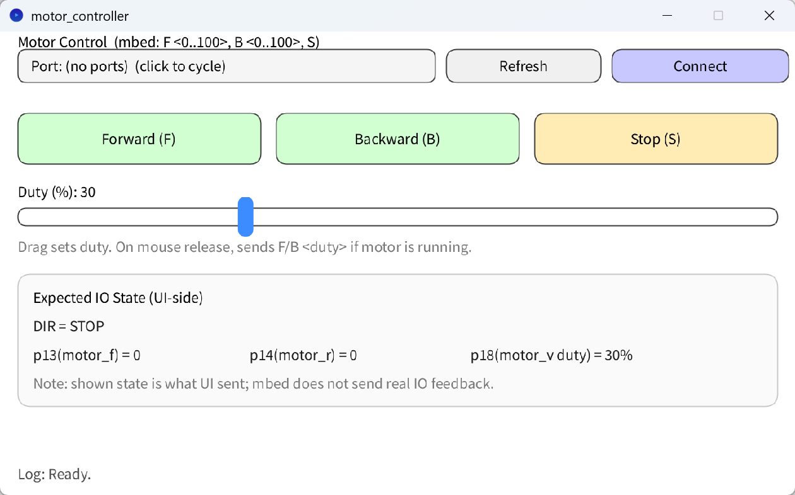
<figcaption>デバッグツール 1: Motor Controller GUI</figcaption>
</figure>
<figure id="fig:debuger2">
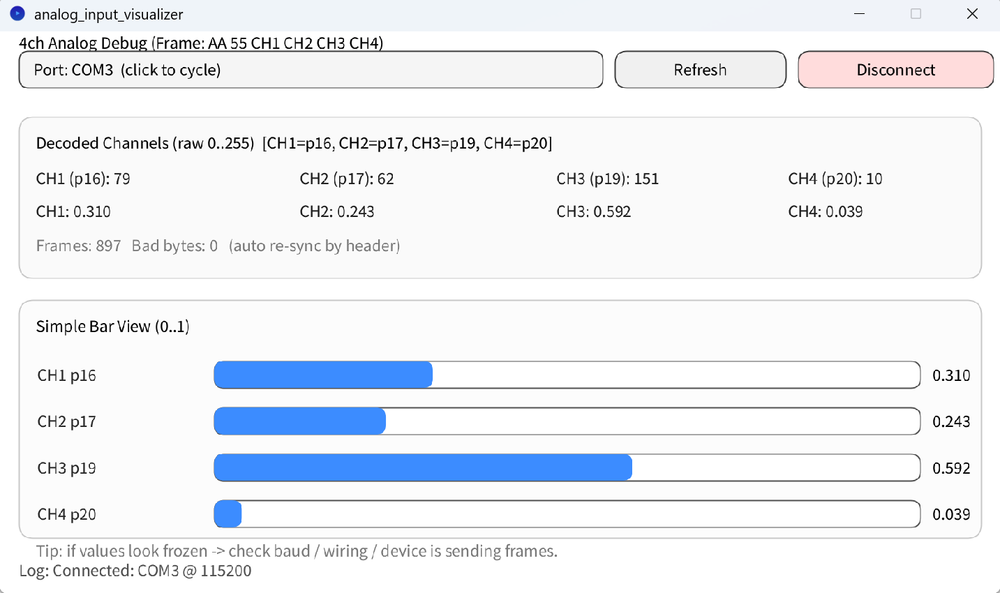
<figcaption>デバッグツール 2: Analog Input Visualizer</figcaption>
</figure>
<figcaption>デバッグツール 1 と 2 の Processing GUI 画面</figcaption>
</figure>

#### 確認チェックリスト

Stage 3 へ進む前に，次を確認してください．

- 振り子を動かすとセンサ出力が正しく変化する

- 角度計算が実際の振り子位置と対応している

- 角速度が適切な値を示している（過剰なノイズがない）

- センサが振り子の動作範囲全体を検出できる

- モータ動作によるセンサ信号への干渉がない

### Stage 3：全体回路の統合

#### 目標

最後の段階では，モータ制御系とセンサ系を統合し，倒立振子を立たせるための完全なフィードバック制御系にします．

#### 最終組立

完全なサンプル回路図[^19]に従って，すべての部品を実装してください．回路全体を見直し，次の点を確認してください．

- すべての電源接続が正しく，しっかり固定されている

- すべてのバイパスコンデンサが IC 電源ピンの直近に取り付けられている

- 配線が整頓されている（図[17](#fig:circuit_sample) 参照）

- ショートの恐れのある配線がない

- すべての部品の向きが正しい（IC，電解コンデンサ）

#### 回路組立の一般的な注意事項

- *見た目がシンプルな回路ほどよく動きます*．電子回路，特にアナログ回路は，わずかな配線方法の違いで特性が変わります．きれいな回路＝シンプルな回路は特性が良くなる傾向があります．

- *ブレッドボードは接触抵抗が大きいので，配線が少ないほど安定して動作します*．1 本の配線で済むところを，複数のジャンパ線をデイジーチェーンしないようにしてください．

- 再度：IC／LSI のピンには触れないようにしてください（抵抗，コンデンサ，LED，三端子レギュレータは触っても構いません）．

- サンプル回路図はあくまで一例ですので，mbed の入出力ピンには別のピンを使うこともできます（ただし，AnalogOut は p18 のみなので変更不可．また，mbed の右側ピンはスペースの都合上使用できません）．使用ピンに合わせてプログラムも変更してください．

- ショートを防ぐため，抵抗の足は適切な長さに切ってください（ただし，切れた足が飛んでいかないよう注意）．

- 色分けのルール：電源のプラス側には赤，GND（0V）には黒を使ってください．

完成した回路の実装例を図[17](#fig:circuit_sample) に示します．

<figure id="fig:circuit_sample" data-latex-placement="hbt">

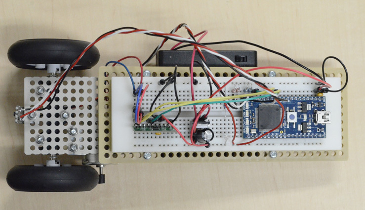

<figcaption>完成回路の実装例</figcaption>
</figure>

#### 統合テスト

全体回路が完成したら，統合された制御系を試験できます．最終制御プログラムでは，モータ制御とセンサ読み取りを組み合わせてフィードバック制御を実装します．この段階では **Debugging Tool 3: Six-Channel Oscilloscope**（，通称 plotter6ch）を使って，各種変数を同時に観測します．

- **3_six_channel_oscilloscope.cpp**: サンプリング周波数 2000 Hz で PD 制御を実装した mbed 制御プログラム（完全版）．2 つのフォトインタラプタ（p19, p20）を読み取り，角度と角速度を計算し，モータ（p13, p14, p18）を制御します．また，フレームプロトコル（ヘッダ: 0xAA 0x55，続いて 6 バイトのデータ）によりシリアル通信（230400 baud）で 6 チャンネルのデータを送信します．制御パラメータ（KP, KD, VLIMIT）はファイル先頭の `#define` 値を編集することで調整できます．

- **3_six_channel_oscilloscope.bin**: mbed へ書き込む用のコンパイル済みバイナリ．

- **3_six_channel_oscilloscope.pde**: 6 チャンネルを上段（CH1-赤，CH2-緑，CH3-青）と下段（CH4-赤，CH5-緑，CH6-青）の 2 つの 3 チャンネルプロットで表示する Processing プログラム．6 チャンネルの内容は通常，(1) フォトインタラプタ1出力，(2) フォトインタラプタ2出力，(3) 角度（センサの差分），(4) 角速度，(5) フィルタ後の角速度，(6) 基準線，です．

これは，完成した倒立振子システムのデバッグとゲイン調整のための主力ツールです．詳しい使い方，通信プロトコル，プログラム変更方法は を参照してください．

#### チーム最終課題：倒立実験（エンコーダ追加前）

Week 1 の終わり（車輪エンコーダ追加前）の目標は，**角度のみのフィードバック** により機体を **倒立** させることです（Week 1 では P 制御だけでも構いません）．plotter6ch（**Debugging Tool 3**）を用いてゲインを調整し，激しい振動なしに立つ状態を目指してください．

**Week 1 での目安：** 原則として，軽く支えた状態でのわずかなゲイン調整だけで基本的な倒立を達成できるはずです．まだ十分な結果が出ていなくても心配しないでください――Week 2 では，より詳しいゲイン調整手順（角速度，フィルタリング，D ゲインの追加を含む）を確認できます: [第[4.4](#sec:w2-task-b)節参照](#sec:w2-task-b). **作業の流れ：**

1.  を mbed へ書き込む（または `#define` のゲインを変更してから をコンパイルする）．

2.  Processing で を開き，オシロスコープ GUI を起動する．

3.  GUI 起動後に mbed を一度リセットする（チャンネルの順番がおかしい場合にフレームの同期を再調整するため）．

!!! warning
    - 電池ボックスが ON の間，モータが回り続けることがあります．倒立実験中以外は OFF にしてください．
    
    - USB が給電するのは *mbed のみ*です．モータが動かない，センサ出力がおかしい場合は，まず電池ボックスのスイッチを確認してください．
    
    - 高周波のビビリ振動が発生した場合は，発熱や破損を防ぐため *直ちに電池ボックスの電源を切ってください*．

**原点合わせ（モータを接続する前に推奨）：**

- モータとモータドライバの接続を外す．

- mbed をリセットする．1 秒の待機時間中に電池ボックスをON にする．

- 機体を手で支えて垂直に立て，角度のトレース（通常は青線）が画面中央付近にあることを確認する．

- 中央にない場合は，センサブラケットの曲げ角度を機械的に微調整して，垂直状態がゼロ角度に対応するようにする．

**最初の倒立試験（P 制御のみ）：**

- モータとモータドライバを再接続する．USB は接続したままでも構わない．

- まず `KD=0` にして `KP` だけを調整する．

- モータの配線方向を確認する：機体が *倒れている方向へ動く* なら正しい．逆方向へ動く（自ら倒れようとする）なら，電源を切ってモータ線（またはmbed とモータドライバ間の 2 本の線）を入れ替える．

- 試験中は，転倒しないように やさしく支えながら，機体の動きを妨げないようにする（機体上部または USB ケーブルを軽く持つ）．

**KP ゲイン調整の指針：**

1.  `KP` が低い場合，ゆったりした（約 1～2 Hz の）振動が見られる．

2.  `KP` を増やすと振動周波数が上がり，振動振幅が小さくなる．

3.  ある程度上げると，振動がほぼない状態で立つようになる（わずかな振動は残ってもよい）．

4.  `KP` が高すぎると，高周波のビビリ振動が現れる．

5.  さらに増やすと，激しい振動になる．

*高周波のビビリ振動は避けてください．* 電子部品やモータの発熱・焼損につながり，ねじが緩む恐れもあります．ビビリ振動が発生したら，*直ちに電池ボックスの電源を切ってください*．

## Week 1 提出物

!!! note "Submission"
    Week 1 の終わりまでに，機体が **倒立** できる状態に到達していることを目標とします．おめでとうございます，この節目に到達できました！
    
      --------------------------------------------------------------------------------------------------------
      **提出物**              **満点**  **採点基準**
      ---------------------- ---------- ----------------------------------------------------------------------
      倒立デモ                   20     **20 pts:** 15 秒以上の倒立，かつ全体が画角内．\
                                        **12 pts:** 倒立は達成したが 15 秒未満，または安定性が不十分．\
                                        **0 pts:** 倒立未達．
    
      安全性・組立の視認性       5      **5 pts:** 機械構造，ブレッドボード，配線がすべて明確に確認できる．\
                                        **0 pts:** 動画で組立が確認できない．
    
      動画の明瞭さ               5      **5 pts:** 撮影中を通じて重要部分が常に見えている．\
                                        **3 pts:** 一部遮蔽はあるが重要な挙動は判別できる．\
                                        **0 pts:** 映像が判読不能（主要部分が遮蔽または画角外）．
      --------------------------------------------------------------------------------------------------------
    
    *任意の添付資料*: Fritzing ファイル（`.fzz`/画像），写真，デバッグツールのスクリーンショット/ログなど．

[^3]: Appendix [\[app:circuit\]](#app:circuit): 回路例．
[^4]: Appendix [\[app:drv8832\]](#app:drv8832): DRV8832 データシート（Texas Instruments）．
[^5]: Appendix [\[app:tpr105f\]](#app:tpr105f): TPR-105F データシート．
[^6]: Appendix [\[app:ld1117v33\]](#app:ld1117v33): LD1117V33 データシート．
[^7]: 機械組立の動画例は course materials repository 内の にあります．
[^8]: 型番，仕様，個数を含む完全な部品表は Appendix [\[app:partslist\]](#app:partslist) を参照してください．
[^9]: Appendix [\[app:re280ra\]](#app:re280ra): RE-280RA データシート（Mabuchi Motor）．
[^10]: ほかにも Arduino，Raspberry PI，PIC などさまざまな系列があります．
[^11]: Keil Studio Cloud: <https://studio.keil.arm.com/>
[^12]: Course materials repository: <https://github.com/UTokyo2026/UTokyo-Control-Practice-2026>
[^13]: Processing は視覚的プログラミング用の無料オープンソースソフトウェアです．<https://processing.org/> からダウンロードできます．2026 年時点で最新の主要リリースは Processing 4 です．詳細は Appendix [\[app:processing\]](#app:processing) を参照してください．
[^14]: Fritzing インストーラ（共有 Google Drive）: <https://drive.google.com/drive/folders/1CwJ8srD090W6hOeP39BXLUZOVy883Kn2?usp=sharing>
[^15]: Appendix [\[app:circuit\]](#app:circuit): 回路例．
[^16]: 回路組立の動画例は course materials repository 内の にあります．
[^17]: Appendix [\[app:circuit\]](#app:circuit): 回路例．
[^18]: Appendix [\[app:circuit\]](#app:circuit): 回路例．
[^19]: Appendix [\[app:circuit\]](#app:circuit): 回路例．
