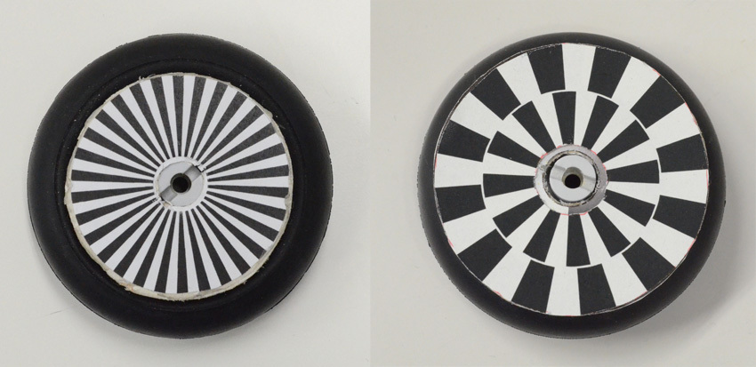
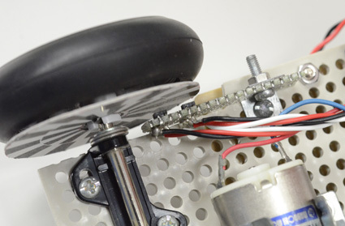
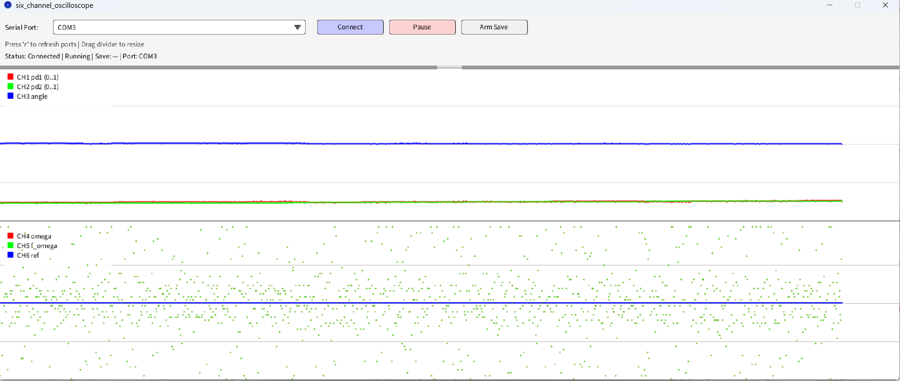
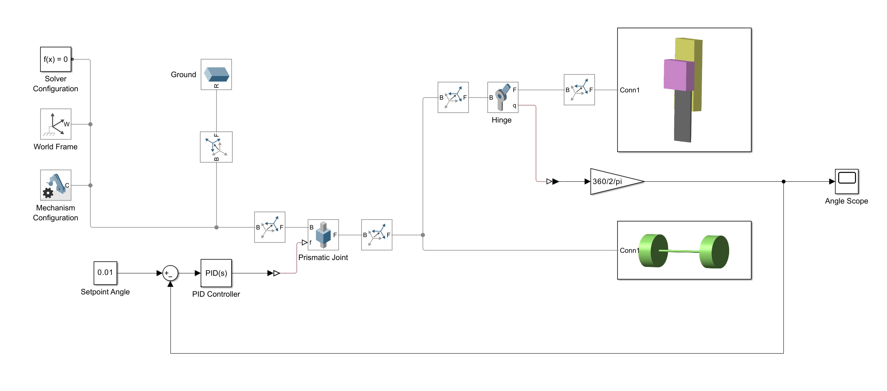
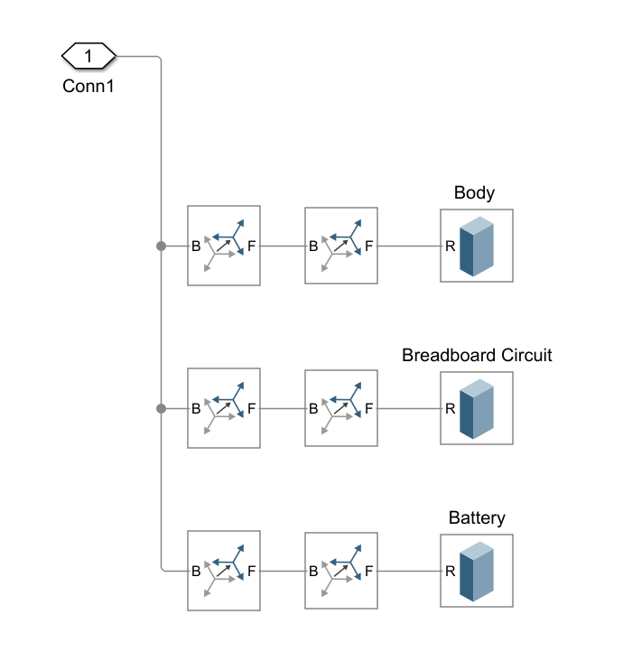
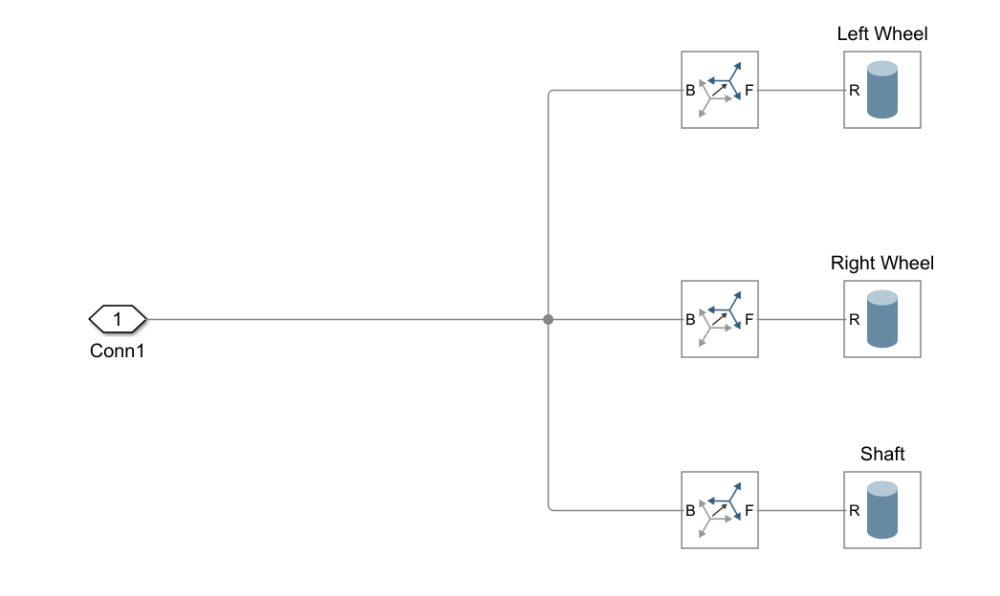
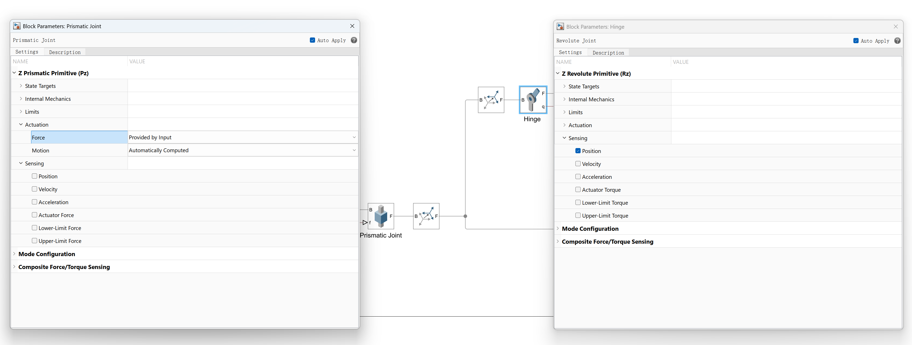
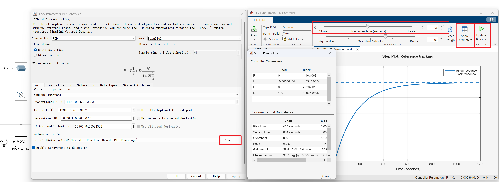
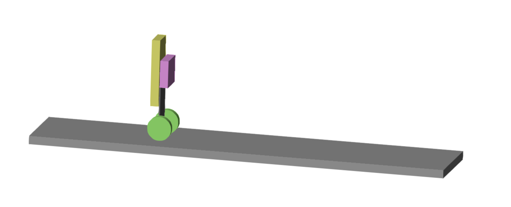

# Week 2: エンコーダと位置制御

## Week 2 の概要と到達目標

Week 2 では，ロータリーエンコーダで機体の運動を計測し，その情報を **シミュレーション** と **実機制御** の両方へ活用することに焦点を当てます．具体的には，(1) 自作エンコーダの製作・取付，(2) 制御コードへのエンコーダフィードバック統合，(3) MATLAB/Simulink シミュレーションへの **位置** と **速度** フィードバック追加，を行います．\

**到達目標：**

- ロータリーエンコーダを製作・取付し，A/B 相波形と回転方向が正しいことを確認する

- エンコーダに基づく位置／速度フィードバックを制御プログラムへ追加し，波形ツールでデバッグする

- シミュレーションへ $x$ と $\dot$ のフィードバックを追加し，実機と比較する

- 倒立を保ちながら，安定した位置制御（少なくとも発散しない状態）を実現する

## 並列作業

推奨する役割分担は，学生 A（エンコーダ製作・取付），学生 B（コードへのエンコーダフィードバック追加とデバッグ），学生 C（MATLAB/Simulink シミュレーション拡張）です．役割は入れ替えて構いませんが，全員が一連の流れを理解してください．

- **学生 A:** Task A（エンコーダ製作・取付） --- [[第[4.3](#sec:w2-task-a)節参照]](#sec:w2-task-a)

- **学生 B:** Task B（コードへのエンコーダフィードバック追加・デバッグ・位置制御） --- [[第[4.4](#sec:w2-task-b)節参照]](#sec:w2-task-b)

- **学生 C:** Task C（MATLAB/Simulink シミュレーション拡張と比較） --- [[第[4.5](#sec:w2-task-c)節参照]](#sec:w2-task-c)

## Task A：エンコーダの製作と取り付け（学生A）

この作業では，機体位置を計測するためのロータリーエンコーダを製作し，機体へ取り付けます．

### ロータリーエンコーダ

倒立振子は，倒立角度だけでなく，位置（または速度）も検出してフィードバックしなければ安定しません． そこで，位置（または速度）の検出方法について考えてみましょう．

最も基本的な方法は，タイヤやモータへロータリーエンコーダを取り付け，回転数を測ることです． 以下ではロータリーエンコーダの仕組みを説明します．

ロータリーエンコーダは，ディスクに描いた白黒パターンをフォトインタラプタで読み取ることで実現できます[^20]． 図[18](#fig:encoder) のように，白黒パターンから数 mm 離した位置へフォトインタラプタを置いてスリットを回転させると，白黒の変化に応じた正弦波状の出力が得られます（距離が近いと矩形波に近づきます）．これを適当な閾値で二値化し，パルスのエッジを数えれば回転角を測れます．これがロータリーエンコーダの基本原理です．

回転方向が一方向だけならこれで十分ですが，双方向に回る場合は回転方向に関係なくカウントが増えてしまうため使えません．そこで，双方向回転を扱う場合はフォトインタラプタを 2 個使います．

図[19](#fig:encoderAB) のように，2 個のフォトインタラプタをスリットパターンの 1/4 周期（または整数 $n$ に対して $(n+1/4)$ 周期）ずらした位置へ置きます．この 2 つの出力を A 相，B 相と呼びます．A 相と B 相は sin と cos のように 90 度位相がずれていますが，その前後関係は回転方向で変化します．例えば正回転（CW）で B 相が 90 度進むなら，逆回転（CCW）では B 相が 90 度遅れます．

したがって，適切に二値化した A 相・B 相に対して図[20](#fig:counting) のような処理を行えば，回転方向も含めて正しく回転角を測れます．図[20](#fig:counting) では A 相のエッジだけを数えており，これは 2 逓倍カウントと呼ばれます（立ち上がりに加えて立ち下がりも数える）．さらに B 相でも同様に数えると分解能は 2 倍になり，これを 4 逓倍カウントと呼びます． エンコーダ分解能をできるだけ高くしたいので，4 逓倍カウントになるようにプログラムしてください．

<figure id="fig:encoder" data-latex-placement="bht">

<embed src="../figs/encoder_principle.eps" />

<figcaption>ロータリーエンコーダの基本概念</figcaption>
</figure>

<figure id="fig:encoderAB" data-latex-placement="bht">

<embed src="../figs/encoder2phase.eps" />

<figcaption>2 相化による CW/CCW 回転の計測</figcaption>
</figure>

<figure id="fig:counting" data-latex-placement="bht">

<embed src="../figs/counting.eps" />

<figcaption>A/B 相パルスのカウント（2 逓倍カウントの例）</figcaption>
</figure>

### ロータリーエンコーダの製作

### スケールの設置

エンコーダを製作する場合，まずスケールの設置場所と分解能を決めます．設置場所として一般的なのは「モータ軸に取り付ける」か「タイヤ（ホイール）に取り付ける」かです．タイヤへ取り付ける場合は，一度タイヤを軸から外し（中央のナット 1 個だけ外す．他のねじは外さないこと），スケールを印刷した紙をホイール内側へ両面テープで貼り付けます．ただし，紙が柔らかいとスケールとフォトインタラプタの距離が変動するため，用意されたプラスチック板（緑色の円板）へスケールを貼ってから，その板ごとホイールへ貼る方がよいでしょう．

*タイヤは次の班が再利用するので，原状復帰できる範囲で工作してください．*
モータ軸に取り付ける場合は，モータ背面からわずかに突き出た軸にスケールを印刷した紙を貼り付けます．両面テープや糊テープをうまく使って貼ってください．しっかり固定するのが難しいですが，ほとんど力がかからないので軽く接着する程度で十分です（その代わりスケールをできるだけ軽くしてください）．モータ側に取り付けると，タイヤに取り付ける場合と比べて，減速比（＝タイヤ半径とモータ先端チューブ半径の比）だけ分解能が上がります．そのため，分割数が粗いスケール（例：90 度ごとに 4 分割）でも十分な性能が得られます．

スケールの分割を細かくするほど分解能は上がりますが，細かいスケールほど高い取付精度が必要です．これは，スケールが細かいほどフォトインタラプタ出力の変化幅が小さくなるためです．取付精度が低いと，回転に伴ってスケール板との距離が変動し，出力のベースラインも揺れてしまいます．すると二値化がうまくできず，エンコーダが動作しなくなります（図[21](#fig:baseline) 参照）．

<figure id="fig:baseline" data-latex-placement="bht">

<embed src="../figs/baseline.eps" />

<figcaption>ベースライン変動の例</figcaption>
</figure>

スケールを粗くすると，フォトインタラプタをスケール板から少し離れた位置（5mm 程度？）に置いても十分な信号振幅が得られます．距離が遠いと，多少の距離変動は問題になりません． したがって，スケールを粗くすると作りやすくなりますが，粗いスケールでは制御が粗くなります．バランスをうまくとってください． いずれにしても，スケールの取付精度が重要です．スケール板をホイールにしっかり固定してください（図[22](#fig:encoder_disc) 参照）．

また，スケールの分解能を決める際は，フォトインタラプタの配置間隔を念頭に置いてください．配布キットではすでに 2 個のフォトインタラプタが基板に半田付けされています．この配置を考慮してスケールを設計してください．設計は PC で行います．Draw 系ソフトウェアで設計してもよいですし，Excel 等で円グラフを描いてスケールとして使うことも可能です．設計後はプリンタで印刷（プリンタがなければコンビニで印刷可）して切り出します． どうしても印刷できない場合は手描きでも構いません．黒い部分はマジックペンなどで塗りつぶしますが，ペンの種類によっては，見た目には黒くても赤外光を反射しやすいものがあります（＝フォトインタラプタには黒と認識されない）ので注意してください．

<figure id="fig:encoder_disc" data-latex-placement="bth">

<figcaption>エンコーダパターンの例．左は 1/4 周期分ずらした位置に配置した 2 個のフォトインタラプタで共通のスケールを読む設計，右は 2 個のフォトインタラプタを同じ角度（ただし中心からの距離が異なる）に配置し，互いに 1/4 周期ずれた 2 本のスリットをそれぞれ読む設計の例．</figcaption>
</figure>

### フォトインタラプタの半田付け

スケールの読み取りはフォトインタラプタで行います．傾斜センサを参考に，フォトインタラプタをユニバーサル基板の切れ端へ半田付けし，L 字金具などでユニバーサルボードへ取り付けます（図[23](#fig:encoder_setup)）．基板は支給しますので申し出てください． 半田付けの要点は演習中に説明します．特に半田付けに慣れていない人は，説明をよく聞いてから作業してください．

<figure id="fig:encoder_setup" data-latex-placement="bth">

<figcaption>フォトインタラプタの取り付け</figcaption>
</figure>

### フォトインタラプタの調整と読み取り

機体へ取り付けたら，フォトインタラプタの配線と抵抗をブレッドボードへ接続します．配布回路図には描かれていませんが，傾斜センサと同様の考え方で接続してください． ただし，フォトトランジスタへつなぐ抵抗値は各自の設計に応じて選んでください（参考までに，機体下部の傾斜センサでは 12k$\Omega$ を使っています）．多くの場合，ターゲットまでの距離は傾斜センサより近くなるため反射光量が増えます．その場合，抵抗値を下げないと出力が飽和します（波形の上側が切れて平らになる）．目安としては 1k$\Omega$ から 5k$\Omega$ 程度がよいでしょう．

取り付けと配線が終わったら，簡易オシロスコープでフォトインタラプタ出力を見ながら二値化の閾値を決めます．二値化した 2 つの信号が概ね 90 度位相差になっていることを確認したら，図[20](#fig:counting) を参考にカウントプログラムを書いてください． 位相差は厳密に 90 度である必要はありませんが，エッジの前後関係が入れ替わると回転方向を誤って読んでしまうので注意が必要です（位相差は 0 度より大きく 180 度未満であればよい）．思った位相差が得られない場合は取付位置などを調整してください．必ずタイヤを一周回し，どの位置でも正しく読めることを確認しましょう．

## Task B：コードへのエンコーダフィードバック追加とデバッグ（学生B）

#### 週間スケジュールとの関係

**Week 1:** **角度の P 制御のみ** で基本的な倒立を達成することが目標でした（[[第[\[sec:w1-standup-pre-encoder\]](#sec:w1-standup-pre-encoder)節参照]](#sec:w1-standup-pre-encoder) 参照）．**Week 2 以降:** 角速度，フィルタ，D ゲイン追加を含めて，さらに調整と改良を進めます．この節ではその詳細手順と安全上の注意をまとめます．

### 完成版制御プログラムの利用

倒立振子の完成版制御プログラムは [^21] に置いてあります．これは単なるデバッグツールではなく，PD 制御，センサ読み取り，モータ制御，リアルタイム可視化まで含んだ **倒立振子制御の完成例** です．

**クイックスタート（事前コンパイル済みバイナリを使う場合）：**

1.  を mbed にドラッグ＆ドロップで書き込む

2.  mbed のリセットボタンを押す

3.  1 秒の待機後にプログラムが起動する

**プログラムの理解と変更：**

制御の仕組みを理解したい場合やパラメータを調整したい場合は，Keil Studio Cloud で を開いてください．プログラム構成は概ね次の通りです．

- **3--11 行目**: 制御パラメータ（`SAMP_FREQ`, `VLIMIT`, `VOFFSET`, `KP`, `KD`）

- **17--30 行目**: ピン定義（LED，モータ，センサ）

- **70--132 行目**: `int0()` 割り込み関数（メイン制御ループ）

- **134--161 行目**: `main()` 関数（初期化と起動）

制御パラメータを変えたい場合は，ファイル冒頭の `#define` を書き換え，再コンパイルして mbed に書き込みます．初期状態では比例制御のみ（`KP = 1.0`, `KD = 0.0`）です．微分制御はこの節の後半で追加します．

プログラムを変更したら「Save」と「Compile」を押してください．エラーがなければ実行ファイル（`.bin`）がダウンロードされ，それを mbed に書き込めます．初期確認だけなら，事前コンパイル済みの をそのまま使って構いません．

### 通信の準備

今回は，mbed の状態をリアルタイムに監視するために 6 チャンネルオシロスコープを用意しています．まず Appendix の説明[^22] に従って Processing をインストールしてください．オシロスコープ本体は にあります．

**オシロスコープの仕組み：** mbed プログラム（）は 2000 Hz で制御ループを実行します．各繰り返しで，センサ読み取り，制御出力計算，モータ制御，そして 230400 baud の USB シリアルで 6 チャンネルのデータを PC へ送信します．データはフレームベースのプロトコルで送信され，各フレームは 2 バイトのヘッダ（0xAA 0x55）に続いて 6 バイトのデータ（各 0〜255）で構成されます．Processing プログラム（）はシリアルポートを継続的に読み込み，ヘッダパターンを探してデータストリームと同期し，6 バイトのデータを取り出してリアルタイムでプロットします．このプロトコルにより，一部のバイトが壊れたり失われたりしても確実にデータを伝送できます．

**オシロスコープの使い方：** を mbed に書き込みます（制御パラメータを変更したい場合は .cpp ファイルを自分でコンパイルしても構いません）．書き込みが終わったら，Processing で を開き，三角形の実行ボタンを押してオシロスコープ画面を開きます．画面は上下に分かれており，上段に 3 チャンネル，下段に 3 チャンネルの計 6 チャンネルが表示されます．mbed プログラムで繰り返し周期ごとに 6 つのデータを送ると，送信順に表示されます（上段 R：赤，G：緑，B：青，下段 R：赤，G：緑，B：青の順）．ただし，オシロスコープ画面を起動した直後は正しい順番になっていないことがあります．画面起動後に mbed を一度リセットすると，表示もリセットされて正しい順番になります（フレームの同期が再調整されます）．

<figure id="fig:debuger3" data-latex-placement="htbp">

<figcaption>デバッグツール 3：6チャンネルオシロスコープのリアルタイム制御データ表示（CH1〜CH3：センサ/角度；CH4〜CH6：角速度，フィルタ後角速度，基準線）</figcaption>
</figure>

は通常，(CH1) フォトインタラプタ 1 出力（上段赤），(CH2) フォトインタラプタ 2 出力（上段緑），(CH3) 両者の差分＝傾斜角相当（上段青），(CH4) 角速度（下段赤），(CH5) フィルタ後角速度（下段緑），(CH6) 128 の基準線（下段青）を表示するよう設計されています．

### 初期設定

### いよいよ実験．でもその前に

いよいよ実験ですが，その前にこの基板の電源の仕組みを理解しておきましょう．

電池ボックスは基板全体（mbed + モータ + フォトインタラプタ）へ電源を供給します．電池ボックスを ON にすると倒立振子全体が起動し，基板上の LED も点灯します．[*電池ボックスが ON の間はモータが回り続けることがあるので，倒立実験中以外は [こまめに OFF] にしてください．*]

一方で，電池ボックスが OFF でも，USB ケーブルで PC に接続すると [mbed 本体だけは USB から給電されます]（モータやフォトインタラプタには USB からは給電されません）．このとき基板上の赤 LED は消えているはずですが，mbed 側の青 LED は明るく点くので，電池ボックスのスイッチが OFF のまま気づかず実験してしまうことがあります．フォトインタラプタ出力がおかしい，あるいはモータが動かないときは，まず電池ボックスのスイッチを確認してください．

### 傾斜センサの原点合わせ

この作業中にモータが動くと困るので，[*モータとモータドライバの接続を外して*]おいてください．mbed に USB ケーブルを接続した状態で，以下の手順でセンサの原点合わせをします．

- mbed 中央のリセットスイッチでリセットする（＝プログラム開始）．

- プログラムは起動後 1 秒間アイドル状態になるように設定されているので，その間に電池ボックスのスイッチを ON にする．

- 機体を手で支えながら垂直に立てる．

- オシロスコープ上段画面に表示される傾斜角（青線）が，垂直状態のときにおよそ 0（＝画面中央）になっていることを確認する（プログラムから 128 を足して送信しているため，センサ出力が 0 のときオシロスコープの線が画面中央に来る）．中央にない場合は，センサを取り付けている L 字金具の曲げ角度を微調整する（ユニバーサルボードは割れやすいので，基板に力をかけず，金具の両端を持って調整すること）．

### 倒立を試す（比例制御）

センサ調整が終わったら，いよいよ倒立を試します[^23]．初期プログラムでは P ゲインのみが設定されており（`KP = 1.0`, `KD = 0.0`），比例制御だけが働きます．

- 電池ボックスの電源を切り，モータとモータドライバを再接続する．USB ケーブルは接続したままでよい．

- モータ接続後，mbed をリセットし，1 秒以内に電池ボックスのスイッチを ON にして，機体を垂直に立てる．制御はリセットの 1 秒後に開始される．

- 軽く機体を手で支えながら機体の反応を観察する．転倒しないようやさしく支えつつ，倒立振子がどちらへ動こうとするかを確認する．倒れた方向へ動けば正しい．傾きとは逆方向へ動く（自ら倒れようとする）なら，モータの接続が逆なので，電源を切ってモータとドライバを結ぶ 2 本の線（または mbed とモータドライバを結ぶ 2 本の線）を入れ替える．

運が良ければこれだけで完璧に倒立できることもあります．そうでなければ，単振動のような動きになるでしょう．比例制御はバネと等価なので，摩擦などの損失がなければ単振動になります．

### ゲインの調整

次に P ゲインを変えて機体応答を見てみましょう．この時点ですでに倒立できている人は，いったん P ゲインを半分以下くらいまで下げてください．[機体の動きを妨げないように，かつ転倒しないように，上部や USB ケーブルをやさしく支えながら] 動作を確認します．

1.  P ゲインが低い場合，ゆったりした（約 1〜2 Hz の）単振動が見られる．

2.  P ゲインを上げる（＝バネを硬くする）と，振動周波数が上がり振動振幅が小さくなる．

3.  ある程度上げると，振動がほぼない状態で安定する（少しビリビリする振動は残ってもよい）．

4.  ゲインを上げすぎると，ガタガタするような高周波振動（この機体では 5 Hz 程度以上のイメージ）が現れる．

5.  さらに上げると，激しい振動になる．

上記 3. の状態が理想ですので，小さい値から大きい値まで一通り試したうえで，3. に近くなるようにゲインを調整してください．摩擦が少ない機体では，P 制御だけでは振動が完全には消えないこともあります．その場合は，振動が最も小さくなる点に合わせてください．

1 や 2 に見られるようなゆったりした振動は，安定性が低いだけで大きな害はありません．しかし 4 や 5 の高周波振動は，過大電流によって [*電子部品やモータの発熱・焼損*] につながる恐れがあります．また，振動でねじが緩んで機体が壊れる危険もあるため，この状態はできるだけ避けてください．

*ガタガタ振動が起きたら，すぐにスイッチを切ってください．*
### 角速度の計算

次に，微分制御を追加します．微分制御は傾斜角の微分＝傾斜角速度をフィードバックするので，まず角速度を計算します．数学的に厳密な微分は行えないため，前回の角度と今回の角度の差を微分の近似値として使います．すなわち， $$\begin
\dot \simeq \frac
\end$$ ここで $\theta_1$ は前回処理時の傾斜角，$T_s$ は繰り返し時間（サンプリング周期）です．この処理は プログラムの `int0()` 関数 79〜80 行目にすでに実装されています．

差分（微分）は高周波信号を増幅する効果があるため，上記で求めた角速度には高周波ノイズが多く含まれています．そのままフィードバックに使うと，ノイズによる微細な振動（「シュー」という音）が発生します．この状態ではモータに大電流が流れて回路に良くないため，プログラム内でローパスフィルタ（LPF）を適用して高周波ノイズを除去します．

プログラムで実現できるディジタルフィルタには IIR（Infinite Impulse Response，無限インパルス応答）と FIR（Finite Impulse Response，有限インパルス応答）の 2 種類がありますが，フィードバック制御では位相遅れが問題になるため，なるべく位相遅れの少ないフィルタが望ましいです．FIR は高周波域で余分な位相遅れを生じやすいため，今回は位相遅れを把握しやすい IIR でフィルタを作ります．

フィルタの次数を上げるほどカットオフ性能は良くなりますが，次数が上がると位相遅れも増えます．そこで，最もシンプルで位相遅れが最小の「1 次ローパスフィルタ（1 次遅れフィルタ）」を使います．双一次変換で求めた 1 次ローパスフィルタのパルス伝達関数は， $$\begin
F(z) = \frac})+(1-\frac)z^}
\label
\end$$ ここで $T$ は 1 次遅れの時定数，$T_s$ はサンプリング周期です．時定数 $T$ の逆数がカットオフ角周波数（rad/s）になります．適切なカットオフ周波数を決めてフィルタ係数を計算してください（「Hz」と「rad/s」の関係に注意）．

フィルタ係数の計算には Matlab が使えます．Matlab で

    [b,a] = butter(1,0.01);

と入力すると 1 次ローパスフィルタの係数が求まります．ここで butter（Butterworth フィルタを求める関数）の第 1 引数は「フィルタ次数」，第 2 引数は「ナイキスト周波数で正規化したカットオフ周波数」（＝ナイキスト周波数に対する比，ナイキスト周波数はサンプリング周波数の半分）です．式([\[eq:firstorder\]](#eq:firstorder))は周波数プリワーピングを行わないため，この式で手計算すると双一次変換の周波数歪みによりカットオフ周波数がわずかにずれますが，Matlab の butter 関数は周波数プリワーピングを行うため，指定したカットオフ周波数が正確に得られます．

1 次遅れフィルタでは，カットオフ周波数の 1/10〜1/5 の周波数から位相遅れが始まることに注意してください[^24]．微分の処理は正弦波の位相を 90 度進める働きがあります（sin を微分すると cos になり，位相が 90 度進む）が，位相遅れがあると正しい微分にならなくなります．前節の比例制御での機体振動周波数（微分制御で抑えるべき振動）を考慮して，その周波数で正しい微分が得られるよう，フィルタのカットオフ周波数を振動周波数の 10 倍以上（最低でも 5 倍以上）に設定してください．

例えば，約 2 Hz で振動している場合，カットオフ周波数を例えば 20 Hz（＝ 40$\pi$ rad/s）以上に設定します．その後，実際の倒立実験で応答状態を見ながら適宜調整してください．

求めたパルス伝達関数をプログラムにするには，次の手順で進めます．まず，伝達関数を $z^$ に関する有理多項式（多項式の分数）にし，分母の定数項が 1 になるよう分母・分子を割ります．こうして得られた多項式の係数を，分子は $b_0, b_1, b_2, \ldots$，分母は $a_0=1, a_1, a_2, \ldots$ とします．今回は 1 次フィルタなので，分子は $b_0, b_1$，分母は $a_0=1, a_1$ だけです．Matlab で計算するとこれらの係数が直接得られます．このとき伝達関数は， $$\begin
F(z) = \frac}} = \frac
\end$$ ここで $X(z)$ はフィルタへの入力信号（Z 変換），$Y(z)$ はフィルタ出力（Z 変換）です．伝達関数は入力と出力の比（Z 変換）であることを思い出してください．

これを整理して逆 Z 変換し，プログラムにします． $$\begin
(1+a_1 z^)Y(z) = (b_0 + b_1 z^)X(z) \\
Y(z) + a_1 z^ Y(z) = b_0 X(z) + b_1 z^X(z)
\end$$ 逆 Z 変換すると， $$\begin
y[n] + a_1 y[n-1] = b_0 x[n] + b_1 x[n-1] \\
y[n] =  b_0 x[n] + b_1 x[n-1] - a_1 y[n-1]
\end$$ これをそのままプログラムに書くだけです．主要部のみ示します（変数宣言省略，左の数字は説明用の行番号）．

    1:    y = b0 * x + b1 * x1 - a1 * y1;
    2:    x1 = x;
    3:    y1 = y;

これで完成です．1 行目がフィルタ計算，2 行目と 3 行目は今回の入出力（$x[n], y[n]$）を保存して，次回の周期で前回値（$x[n-1]$, $y[n-1]$）として参照できるようにします．

プログラムができたら，フィルタ前後の角速度信号がオシロスコープ画面でどう変化するかを確認しましょう．フィルタ前後の値をオシロスコープへ出力するようプログラムを変更してください．フィルタが正しく動作していれば，ノイズが低減されていることを確認できるはずです．フィルタ結果に若干のノイズが残っていても構いません．ノイズが完全に見えなくなるほど強くフィルタをかけると，過フィルタになっています．その場合，信号に大きな遅れが生じているはずです．フィルタをかけると必ず時間遅れが生じますが，視覚的に明らかに遅れているようなら過フィルタです．カットオフ周波数を[上げて]フィルタ効果を弱めてください．

### 微分制御も加えて倒立

角速度が計算できたら，D ゲインを加えて PD 制御を行いましょう．フィルタを通した角速度に D ゲインを掛けて，式([\[eq:pd\]](#eq:pd)) に合わせてください． P 制御だけですでに安定している機体では，D ゲインを加えても安定性が増したように見えないかもしれませんが，外乱に対する応答に D ゲインの効果が現れるはずです． 外乱を加えるには，倒立した機体を指で軽く突いてください．D ゲインなしでは，倒立状態に戻る際にフラフラと振動しますが，適切な D ゲインがあれば振動が素早く収束します（機体によっては効果が見えにくいこともあります）．

実際に D ゲインの大きさを変えて応答を見てみましょう．D ゲインの大きさ（ここでは）は P ゲインの数分の一から 1/20 程度が目安です． [理論的には D ゲインが大きいほど振動が収まるはずですが，実際には D ゲインが大きすぎると逆に振動が増えるので注意してください][^25]． 機体がビリビリしている場合，D ゲインが大きすぎる可能性があるので，D ゲインを下げてみてください（機体によっては D ゲイン 0 が最適なこともあります）．

### ここまでのまとめ

激しい振動なしに倒立し，外乱への応答がなめらかになれば，ひとまず完成です．位置フィードバックをかけていないため，倒立振子が徐々に逃げてしまう（そして転倒する）のは避けられません．

ここまでは説明通りに作れば問題なく到達できるはずですが，実習の本番はここからです．ここからは，自分で考えながら製作を進めてください．

### 位置制御

位置が読めるようになったら，傾斜角制御と同様に，まず位置に対して比例ゲイン（$K_x$）だけを加えて（傾斜角制御の操作量に足して）制御してみましょう．具体的にはモータ電圧は $$\begin
v_m = K_p \theta + K_d \dot + K_x x + K_v \dot
\end$$ となります（この時点では位置微分ゲイン $K_v$ はゼロ）．

ゲイン $K_x$ の正しい符号は正か負かわかりません（各自のロータリーエンコーダの設定に依存します）．とりあえず試してみて，機体が前後に振動するなら符号は正しいです．振動せずに一方向に走り去る場合は位置ゲインの符号が逆（または，エンコーダ出力が逆）ですので，符号を変えて再試行してください（エンコーダプログラムを修正しても構いません）．

正しい符号がわかったら，比例ゲインの大きさを変えながら応答の変化を見てみましょう．機体をやさしく手で支えながら，倒立振子の動きを読む意識で操作してみてください．ゲインが小さいとゆっくり大きく振動し，大きいと速く細かく振動します．先の傾斜角制御では比例ゲインだけで静止できたこともあったかもしれませんが，ここでの位置制御では，比例ゲインだけでは振動応答しか得られません（さらに，信号遅れや逆起電力の影響で振動振幅が徐々に増大します）．

傾斜角制御実験と同様，ゲインを大きくしすぎると激しい振動になります．激しい振動は部品の破損につながるため，[*激しい振動が起きたら直ちに電源スイッチを切ってください*]．

多くの場合，ゆっくり振動している付近（約 0.5 Hz？）が適切な比例ゲインですので，そこを目標に調整してください．この振動は次に設定する微分制御で抑制されますが，その振動周波数が微分制御の効く範囲（ローパスフィルタのカットオフ周波数の 1/10 以下程度）に入っていることが重要です．分解能の高いエンコーダがある人は速度フィルタのカットオフ周波数を高く設定でき，より高い周波数まで減衰させられるので，速めの振動に調整しても構いません（その方が位置の応答が素早くなります）．自分のエンコーダ性能と速度ローパスフィルタの特性を念頭に置いて調整してください．

一般に，倒立振子の位置制御は次のような興味深い動作をします．機体を右へ移動させたい場合，位置制御系（$K_x$ と $K_v$ による制御）は逆に左方向へタイヤを回そうとします．タイヤが左へ動くと，慣性により機体は右へ倒れます．すると傾斜角制御系（$K_p$ と $K_d$）がこの傾きを補正するためにタイヤを右へ回し，結果として機体は右へ進みます．つまり位置制御系は，直感とは逆に，目標位置から離れる方向へ動けと指令を出しています．しかし，傾斜角制御系が支配的なので，結果的に位置制御系が指令した方向と逆へ動くというわけです．自分が作った倒立振子がどのような動作をするか確認してみましょう．

### 速度の計算と微分ゲインの追加

最後に速度を計算して微分制御を加えます．速度の計算はエンコーダ出力を微分（差分）して求めますが，今回作ったエンコーダの出力はごくたまにしか変化しません（タイヤが少なくとも目盛り1つ分回転しないとカウントされない）．そのため，単純に前の値との差分を取ると，エンコーダ出力が変化したときだけインパルスが出る奇妙な速度信号になります．これを滑らかにするためにローパスフィルタをかけます．角度の微分と違い，かなり強いフィルタをかける必要があるため，2次のローパスフィルタを使いカットオフ周波数を低く設定してください（MATLABの `butter` 関数で設計します）．ただし，カットオフを低く設定すると制御できる運動周波数も低くなります．機体位置の振動周波数が制御可能な周波数範囲内に収まるように位置ゲインを低く設定する必要があります（その結果，位置制御のばね定数が小さくなり，機体が完全には止まらずにふらふらすることは避けられません）．

この場合，微分ゲイン（速度ゲイン $K_v$）の大きさは比例ゲインと同程度かその数分の一になります．[^26]

今回は位置センサ（エンコーダ）の分解能が低いため，速度にエンコーダの差分値を使っている限り振動を完全に抑えることは難しいです．振動が発散しない程度に調整できれば十分です（一定振幅で揺れる状態）．

さらに性能を上げたい場合は，エンコーダの差分を使わず別の方法で機体速度を推定してみてください．具体的にはモータへの印加電圧を使います．定常状態，すなわち速度が一定の状態では，摩擦を無視するとモータトルクはゼロになります．式（[\[eq:motor_simple_equiv\]](#eq:motor_simple_equiv)）を見ると，モータトルクがゼロのとき印加電圧と逆起電力（速度に比例）が一致します．したがって，印加電圧からモータ回転速度（＝機体速度）を推定できるはずです． ただしこれは定常状態の話なので，速度が変動しているときには成り立ちません．しかし，そのあたりをうまく考えて使えば，エンコーダだけに頼るよりも良い制御ができるはずです． なお，このようにして速度を推定する場合，位置制御系ではなく速度制御系を構築した方が良いです（つまり，機体位置に対する PD 制御ではなく，逆起電力の平均値に対する P 制御を行います）．その場合は次節の説明を読み飛ばしてください．

### 走らせよう

ほぼ一定の位置で倒立できるようになったら，走らせます．走らせる際は，制御の目標位置を少しずつ変化させます． 具体的には，モータ電圧の指令値は次の通りです． $$\begin
v_m = K_p \theta + K_d \dot + K_x (x - x_) + K_v \dot
\end$$ 式中の $x_$ は制御の目標位置です．位置に対して PD 制御がかかっているため，機体は目標位置とばねとダンパでつながれているのと等価な状態にあります．したがって，プログラム中でこの目標位置 $x_$ を少しずつ変化させると，倒立振子は目標位置に引っ張られるように移動するはずです（犬を散歩させる感覚です．ただしばねで引っ張るイメージなので，ばねによる振動が生じます．大きく動いて少し止まる，という動きになりがちです）．たとえば制御ループのたびに目標位置を $0.001$ ずつ増やすと，制御周波数が 2000 Hz の場合，1 秒あたりエンコーダ 2 パルス分進むはずです．

なお，倒立制御を開始した直後は機体の姿勢制御がまだ十分安定していないため，倒立制御開始から約 1 秒待ってから目標値の変更を開始するようにプログラムしておくとよいでしょう．

### 後は工夫次第

あとは自分でさまざまに調整しながら高性能な倒立振子を目指してください．エンコーダの改善，制御ゲインの調整（フィルタ調整も含む），またエンコーダによってモータ回転速度がわかるので，これまで無視してきたモータ逆起電力についても考えてみるとよいでしょう．

調整のポイントをいくつか挙げます．

- 制御ゲインの組み合わせ，フィルタ設定，目標速度が重要です．さまざまな組み合わせを試すうちに，安定して走る設定が見つかるでしょう．部品や組み立ての個体差があるため，最適な設定は機体ごとに異なります．

- 実はこのモータ（これに限らず，同タイプのモデルモータの多く）は回転方向が決まっており，正転と逆転でわずかに特性（トルク）が異なります．トルクが弱い方向に回転するとき，少し（多くても 10% 程度？）余分に電圧を加えると特性の差を小さくできるかもしれません．

- モータ自体やモータとタイヤの動力伝達部に摩擦があるため，0 V 近傍の小さな電圧ではモータが摩擦に負けて回転しません．摩擦を補償するために指令電圧にわずかなオフセットを加えるとよいかもしれません．ただし，オフセットが大きすぎると機体の応答が振動的になるので注意してください． の先頭で `#define` されている `VOFFSET` に値を設定するとオフセットが加わります（値は最大でも 0.01 程度が安全です）．

- 傾斜角は床面からの反射光量で測定しているため，床面の赤外線反射率によって傾斜センサのゲインが変わります．異なる床面で走行する場合は，必要に応じて制御ゲインを微調整してください．

## Task C：エンコーダフィードバックを含む MATLAB シミュレーション（学生C）

### シミュレーションの役割

計算機シミュレーションは，制御アルゴリズムを設計し検証するための強力な道具です．シミュレーション環境なら，たとえ設定を誤ってもハードウェアは壊れず，不安定なコントローラでも物理的な危険はありません．不適切な制御で転倒したり激しく走ったりする倒立振子にとって，シミュレーションはモータ，電子回路，機械構造を守る安全な試験場になります．

MATLAB と Simulink を使うと，コントローラ設計を高速に反復できます．毎回マイコンへ書き込み直したり，実機を組み直したりせずに，パラメータを変えて応答を観察し，複数の戦略を比較できます．また，シミュレーションは系の理論的な振る舞いを見通しやすくし，制御パラメータが安定性や性能へどう影響するかの直感も与えてくれます．シミュレーションで妥当性を確認したパラメータは，より高い確信を持って実機へ移せます．

さらに，シミュレーションは現代の制御技術者にとって重要な基礎技能です．MATLAB/Simulink のような実務的ツールを用いて，制御対象をモデル化し，解析し，設計する力は，産業界でも研究でも広く使われています．

### MATLAB 環境の準備

### 東京大学での MATLAB 利用

東京大学では包括ライセンス契約により，構成員が MATLAB ライセンスを利用できます．MATLAB Online を使っても，自分の PC へインストールしても構いません．利用開始手順は次の通りです．

- UTokyo の MATLAB 案内ページ <https://utelecon.adm.u-tokyo.ac.jp/matlab/> を開く

- 「MATLAB の利用を開始する」の案内に従う

- UTokyo メールアドレスで MathWorks Account を作成する

- UTokyo ポータル経由でサインインし，MathWorks アカウントを大学ライセンスへ紐付ける

ライセンス有効化で問題が起きた場合は，utelecon の案内ページまたは MathWorks サポート（`service@mathworks.co.jp`）を参照してください．

### 必要なツールボックス

本演習では，少なくとも以下の MATLAB 製品が必要です．

- **MATLAB**（基本環境）

- **Simulink** - ブロック線図の構築とシミュレーション

- **Simscape** - 物理系モデリング

- **Simscape Multibody** - 多体系の機械ダイナミクス（倒立振子，ジョイントなど）

- **Simulink Control Design** - Simulink/Simscape モデルを線形化して PID Tuner や Model Linearizer を使う場合に必要

- **Control System Toolbox** - LTI モデルを用いた解析・設計（LQR，周波数応答など）や，LTI プラントに対する PID Tuner で有用

インストール時にこれらを選択してください．すでに MATLAB を入れていて不足がある場合も，Add-On Explorer（Home タブ $\rightarrow$ Add-Ons $\rightarrow$ Get Add-Ons）から追加できます．配布モデルは，Control System Toolbox だけや手書きの状態空間ブロックではなく，Simscape / Simscape Multibody によって倒立振子の物理ダイナミクス（3D 部品を含む）を表現しています．

### Simulink モデルの構築

本演習では，参考用の Simulink/Simscape モデルをマイルストーン例として配布しています．この例の狙いは過度に野心的なものではなく，Simscape Multibody で物理的に意味のあるプラントモデルを作る方法と，*傾斜角* に対するフィードバックループを閉じて PID で倒立振子を安定化する流れを示すことにあります．配布モデルでは，角度安定化までは調整済みですが，位置・速度の制御は学生向け拡張課題として残してあります．

図[25](#fig:simulink_overview) に，このモデル全体の Simscape Multibody 構成を示します．最上位でも実機構成を反映するよう整理されており，カート側は車輪関連部品，"body" 側は振り子本体と付属部品をまとめた剛体アセンブリになっています．これにより，どのパラメータがカート側（車輪半径，車輪慣性，カート質量）に属し，どれが振り子本体側（質量分布，長さ，重心）に属するのかを見分けやすくなっています．

<figure id="fig:simulink_overview" data-latex-placement="h">

<figcaption>配布マイルストーン例の Simscape Multibody 全体図．モデルはカート（車輪関連アセンブリ）と body（振り子関連アセンブリ）に分けられ，ジョイントとフレーム変換で結ばれている．</figcaption>
</figure>

### プラントモデルの考え方

プラントは，3D 剛体，ジョイント，固定フレーム変換を組み合わせて Simscape Multibody 上に構築します．線形化済みの状態空間行列を直接打ち込む代わりに，形状，質量，慣性といった物理パラメータを与えると，Simscape Multibody が多体系の運動方程式を自動的に導きます．この方法は実機構造との対応が取りやすく，電池やブレッドボード，ブラケットなどの質量分布を変えたときにダイナミクスがどう変わるかを直感的に確認できるので，本演習に適しています．

配布モデルでは，カート側と body 側を主に **Brick Solid**（直方体）と **Cylindrical Solid**（円柱）で構成しています．車輪，軸，スペーサは円柱で自然に表せますし，本体板，ブラケット，電子モジュールは直方体で十分近似できます．目標は写真のような形を再現することではなく，支配的な質量と慣性を捉え，シミュレーション上の設計判断が実機でも意味を持つようにすることです．

図[26](#fig:simscape_body_build) は *body* サブアセンブリ，図[27](#fig:simscape_wheel_build) はカート／車輪側サブアセンブリを示しています．

<figure id="fig:simscape_subassemblies" data-latex-placement="h">

<figure id="fig:simscape_body_build">

<figcaption>Simscape Multibody における body モデル．</figcaption>
</figure>
<figure id="fig:simscape_wheel_build">

<figcaption>Simscape Multibody における wheel モデル．</figcaption>
</figure>

<figcaption>倒立振子モデルで用いている Simscape Multibody サブアセンブリ．</figcaption>
</figure>

これらの剛体を一体のアセンブリとしてつなぐために，モデルでは **Rigid Transform** ブロックを用います．Rigid Transform は 2 つの座標系の間の固定平行移動と固定回転を定義するブロックであり，カート座標系に対する車輪配置，振り子本体とその基準座標系のオフセット，ブレッドボードや電池など補助質量の配置に広く使われます．実際に重要なのは，車輪や body の *質量* と *サイズ*，そしてブレッドボード回路や電池モジュールに割り当てた質量・寸法です．これらが慣性を決め，ひいては安定化コントローラをどれだけ "攻めた" 設定にできるかへ強く影響します．

多体系モデルの利点の一つは，シミュレーション中に 3D 動作を可視化でき，ジョイント角度や位置などの信号をそのままコントローラへ結びつけられることです．もし純粋に解析的なプラントを使いたいなら，先に導いた線形化 $A,B,C,D$ 行列を Simulink の State-Space ブロックへ入力して表現しても構いません．どちらも有効ですが，ここでは配布された多体系モデリングの流れを理解することを主眼とします．

### コントローラ内部の構成

物理モデルの中では，剛体同士の相対運動を定義するジョイントが重要な役割を果たします．配布例では，body はカートに対してヒンジ状の回転ジョイントで接続され，カートは床面方向へ並進できるようになっています．Simscape Multibody では，この回転ジョイントが **Revolute Joint**，並進ジョイントが **Prismatic Joint** に対応します．これらは単なる拘束条件ではなく，シミュレーション中に制御へ戻すフィードバック信号の主要な取り出し口でもあります．

実機では，傾斜角は床面反射光を見ている 2 個のフォトリフレクタ（フォトインタラプタ型センサ）から推定しています．また，車輪と床面の相互作用も「床面摩擦そのものを直接測る」わけではなく，モータ駆動と床反力の結果として現れます．マイルストーンモデルでは，まず制御の本質へ集中するため，これらを抽象化しています．すなわち，傾斜角は Revolute Joint の角度から直接取り出し，カートと床面の相互作用は Prismatic Joint の座標で表します．このようにすることで，機械的拘束を保ったまま素直にフィードバックループを閉じられます．

図[29](#fig:simscape_joints_actuation) は，配布モデルで角度ジョイントと並進ジョイントがどのように設定されているかを示しています．Revolute Joint からは body 角度（必要なら角速度も）を取り出せます．Prismatic Joint からはカート位置と速度が得られます．さらに，マイルストーン例では Prismatic Joint を駆動点としても使っており，その運動／力を駆動することで body を安定化するカート運動を実現しています．位置制御を入れるなら当然ここからカート位置を読みますし，速度制御を入れるなら速度を直接使うか，後述する課題のようにエンコーダ相当の量子化を通して推定しても構いません．

<figure id="fig:simscape_joints_actuation" data-latex-placement="h">

<figcaption>配布多体系モデルにおけるジョイント構成．body 角度は <strong>Revolute Joint</strong>（ヒンジ）から取得し，床面方向のカート移動は <strong>Prismatic Joint</strong> で表す．Prismatic Joint は駆動点としても，外側ループ用の位置／速度信号源としても利用できる．</figcaption>
</figure>

これらの信号が取り出せるようになると，コントローラブロックで安定化ループを閉じられます．マイルストーン例では，主フィードバック信号として振り子の傾斜角だけを使っており，いわば *角度のみの安定化器* です．位置ループや速度ループは，学生が体系的に拡張できるよう，あえて初期状態では入れていません．

<figure id="fig:simulink_highlevel" data-latex-placement="h">

<figcaption>マイルストーン例で用いる PID コントローラサブシステム．配布コントローラは傾斜角を制御して倒立を安定化する．PID パラメータは手動でも PID Tuner でも調整できる．</figcaption>
</figure>

### シミュレーションの実行

course materials フォルダ内の `.slx` モデルを開き，MATLAB 上で実行してください．実行前には，現実的なディジタル制御ループに合わせて設定を整えます．**Simulation** $\rightarrow$ **Model Configuration Parameters**（Ctrl+E）で **fixed-step** ソルバを選び，実機の制御周波数に対応した時間刻みを設定してください（例えば 1 kHz なら 1 ms など）．サンプリング時間を合わせることは，安定余裕に影響し，後で実機へパラメータを移したときの予測精度にも関わります．

安定化を観察するには，Revolute Joint に小さな初期傾斜角（例えば $\theta(0)=0.1$ rad $\approx 5.7^\circ$）を与えて，コントローラが打ち消すべき外乱を作っておきます．そのうえでシミュレーションを走らせ，角度スコープを開いて，角度が直立平衡点へ戻るかを確認してください．外乱入力が用意されているなら，短いインパルスやステップ外乱を与えて，どれくらいの速さで回復するかを見ても構いません．

### PD コントローラ設計とパラメータ調整

マイルストーンコントローラは倒立維持に焦点を当てているため，フィードバックとして振り子角度のみを用います．最も単純な形では，角度 $\theta$ と角速度 $\dot$ に基づく次の PD 則になります．

$$\begin
u = K_p \theta + K_d \dot
\end$$

ここで $u$ は，モデル内でカートを動かすための駆動信号です．比例項は直立姿勢へ戻ろうとする復元力を与え，微分項は振動を抑える減衰を与えます．実際には角速度フィードバックはノイズに敏感なので，フィルタを通して使うことが多く，Simulink の PID ブロックにはそのための微分フィルタ係数が用意されています．

### PID パラメータの確認と調整

ゲインを変更するには，コントローラサブシステム（図[30](#fig:simulink_highlevel)）を開き，角度制御に対応する PID ブロックをダブルクリックします．ブロック設定画面から $K_p$，$K_d$，微分フィルタ係数 $N$ を変更できます．配布モデルには一応動く初期パラメータが入っていますが，この課題で重要なのは，質量や慣性といった物理パラメータが，制御をどれだけ強くできるかにどう効くかを理解することです．したがって，自分で意図的にゲインを変え，時間応答がどう変わるかを見てください．

より系統的に調整したい場合は **PID Tuner** を使って構いません．PID ブロックの設定画面から PID Tuner を開き，**Tune** を押すと，動作点でプラントを線形化して設計方針に応じたゲイン候補を提示してくれます．この演習では，目標応答速度を実機のサンプリング時間から想定される制御帯域に合わせるのがよいでしょう．調整後は，得られたゲインを PID ブロックへ戻してシミュレーションに反映してください．

### シミュレーション結果の解析

シミュレーション実行後は，角度スコープを見て本当に安定化できているかを評価します．良い結果では，角度が適度なオーバーシュートの範囲内で 0（直立）へ戻り，平衡点へ近づくにつれて制御入力も小さくなります．もし制御入力スコープがあるなら，駆動信号が長時間飽和していないかも確認してください．飽和が続く場合は，ゲインが攻めすぎているか，あるいは質量・慣性パラメータを見直す必要がある可能性があります．

<figure id="fig:simulation_result" data-latex-placement="h">

<figcaption>倒立振子シミュレーション結果の例（Sim6）．</figcaption>
</figure>

### 何を見るべきか

健全な結果では，角度応答は振動しながらも減衰しつつ 0 へ戻り，時間とともに離れていくようなドリフトは生じません．発散するなら安定化ゲインが弱すぎるか符号が誤っています．ほぼ一定振幅で振動し続けるなら減衰が不足しており，微分ゲインやフィルタを見直す必要があります．極端に遅い応答ならゲインが保守的すぎます．制御入力が長時間飽和する場合は，より穏やかな設定にするか，電池やブレッドボードへ過大な質量を与えていないかなど，プラントパラメータを見直してください．

### 発展課題

マイルストーンモデルで角度安定化ができたら，拡張の方向は多数あります．自然な次の一歩は，Prismatic Joint から得られる信号を使ってカート位置・速度の外側ループを追加することです．また，手動での PID 調整と，全状態フィードバックや LQR のようなより系統的な方法とを，同じ試験条件で比較して性能差を明確にするのも有益です．

### シミュレーションから実機へ

シミュレーション上の振る舞いに納得できたら，そのコントローラ概念を実機へ移せます．ただし，シミュレーションが *何を省略しているか* は常に意識してください．実機では，角度センサは 2 個のフォトリフレクタから構成されるため，ノイズ，床面反射率依存性，非線形性を含みます．同様に，実機のカート運動は理想的に駆動される Prismatic Joint ではなく，モータトルクと車輪・床面相互作用の結果として生じます．だからこそ，サンプリング時間を一致させ，制御入力を現実的な範囲へ抑えることが，シミュレーション結果を実機へ役立てるうえで重要になります．

### 離散化

マイコン実装は離散時間系（サンプリング系）です．Simulink で連続時間 PID ブロックを使っていても，実機では有効サンプル時間 $T_s$ を持つ離散制御として動作します．倒立振子では 1--10 ms 程度が一般的です．$T_s$ を小さくすると一般に位相余裕や安定性は改善しますが，計算負荷は増え，量子化されたエンコーダ信号を差分して速度を求める場合はノイズも増えやすくなります．

配布 mbed コード（Section [\[sec:inverted-experiment\]](#sec:inverted-experiment) 参照）では，通常タイマ割り込みは 1 ms（0.001 秒）に設定してあり，これは 1000 Hz サンプリングに相当します．予測精度を上げるため，Simulink 側も同じ刻みの fixed-step 設定にしてください．

### パラメータの移し替え

Simulink 上で得た最終的な $K_p$ と $K_d$ を記録し，mbed プログラムへ直接移します．例えばシミュレーションで $K_p = 50$，$K_d = 5$ を使ったなら，mbed コードでは

    float Kp = 50.0;
    float Kd = 5.0;

のように書きます．単位の整合には注意してください．シミュレーションでは角度が rad で表現されていても，実機ではエンコーダカウントなどから rad へ換算する必要がある場合があります．

### シミュレーションと実機の差

完全なシミュレーションは存在しないので，実機との差は必ず生じます．質量・慣性パラメータ，モデル化していない摩擦やバックラッシュ，アクチュエータの飽和やデッドゾーンなど，効いてくる要因は多くあります．センサ側でも，実信号はノイズと量子化を含みます．フォトリフレクタによる角度推定は床面反射率でずれますし，エンコーダ差分で求める速度は簡単にノイジーになります．さらに計算遅れや離散化も安定余裕を削ります．したがって，シミュレーションはまず安全にアイデアを検証し，妥当な初期ゲインを得る場と考え，最終調整は実機で保守的に進めるのがよいでしょう．

### 課題：エンコーダ相当の信号を用いた位置・速度ループの追加

マイルストーンモデルは傾斜角の安定化までしか行っていません．この課題では，カート運動に対する外側ループを追加し，さらにエンコーダ相当のフィードバックをモデル化することで，より現実に近い制御系へ拡張してください．典型的には，位置ループが速度指令を作り，速度ループがプラントを駆動する指令を作り，その内側で角度安定化器が働く構成になります．ただし構成は一つに限定しません．自分で選んだループ構造を明確に書き，シミュレーション結果に基づいて妥当性を説明してください．

エンコーダらしさを出すには，理想的な連続位置・速度信号をそのまま使わず，まず位置を離散カウントへ量子化し，そこから差分（必要ならフィルタ付き）で速度を再構成します．こうすると，実機で直面するジッタや遅れを自然に導入できます．このエンコーダ相当の信号経路で位置・速度ループを閉じ，倒立挙動の頑健性がどれだけ保たれるかを確かめてください．

最後に，意味のある指令と外乱の下で拡張コントローラを評価してください．最低限，ステップ，ランプ状の移動，2 つの位置を往復する指令（正弦波や区分一定信号など）を含む位置目標を試してください．さらに，カートや body に短いインパルス／力外乱を与え，どれくらいの速さでバランスを回復するかを記録します．レポートには，角度，カート位置，制御入力の時間応答とともに，調整方針や観察された限界（飽和，振動，量子化ノイズへの感度など）を簡潔にまとめてください．

## 補足：トラブルシューティングと高速化

### 補足1：あれっ？ モータが弱くなったな？ と思ったら

ブレッドボードは比較的接触抵抗が大きく，特に大電流が流れるモータドライバ周辺では，その接触抵抗に起因するトラブルが起こりがちです．モータの力が弱くなったと感じたら，モータドライバや周辺のジャンパ線を数回抜き差ししてみてください．

今回のドライバは最大 1A 程度をモータへ流します（そのときの電圧は 1V 程度）．一方，ジャンパ線はブレッドボード内部の 2 枚の金属板に挟まれているだけなので，接触部分にはある程度の抵抗があります．例えば接触抵抗が 0.5$\Omega$ あると，1A 流したときに 0.5V もの電圧降下になり，モータ駆動電圧に対して無視できません．

実際の接触抵抗はそこまで大きくないことが多いものの，端子表面の酸化によって時間とともに増えていくケースがあります．特に大電流が流れる接触部は発熱しやすく，その熱が酸化を進めてさらに接触抵抗が増えるという悪循環が起きます．ブレッドボード上では，モータとドライバにとってあまり都合のよくない状況が存在しているわけです． したがって，「プログラムは変えていないのに性能が落ちた」と感じたら，接触抵抗の増大を疑ってください．ドライバチップやジャンパ線を数回抜き差しすると，表面の酸化膜が削れて接触が回復することがあります．

特に重点的に確認すべきなのは，ドライバ周辺で大電流が流れる経路です．モータ電流の経路を追うと，「電池の＋極」$\rightarrow$「（ドライバの）VCC 端子」$\rightarrow$「OUT1（または 2）」$\rightarrow$「モータ」$\rightarrow$「OUT2（または 1）」$\rightarrow$「ISEN 端子」$\rightarrow$「GND」$\rightarrow$「電池の－極」となります．この経路を重点的に見直してください．

### 補足2：高速化のために

データシート（配布した簡易版ではなく，TI が発行している正式なデータシート[^27]）によると，今回使用するモータドライバには電流が 1.3A を超えるとトリップする（回路を遮断し電流を 0A にする）保護回路が内蔵されています．実際にモータを接続して測定したところ，モータ電流が脈動しているためか，平均電流約 1.1A でトリップすることが確認されました．トリップするとモータが停止してしまうため，制御プログラムではドライバがトリップしないようにモータ電圧の上限を設定しています（ の `VLIMIT` 定義を参照）．この上限値について考えてみましょう．

モータのインダクタンスを無視すると，モータドライバがモータへ印加する電圧 $V$ と実際に流れる電流 $I$ の関係は次のように表されます． $$\begin
V = (R_m + R_c) I + \kappa\omega_m
\end$$ ここで $R_m$ はモータの巻線抵抗，$R_c$ はモータ駆動回路の抵抗，$\kappa$ は逆起電力定数（$\approx$ トルク定数），$\omega_m$ はモータ回転速度（rad/s）です．このモータでは，巻線抵抗 $R_m$（モータ内部のブラシの当たり方＝モータ軸の角度によって変動）は平均約 0.7 $\Omega$，逆起電力定数 $\kappa$ は約 2.7 mV s/rad と推定されます．回路抵抗 $R_c$ は約 0.5 $\Omega$（ドライバの ON 抵抗 0.45 $\Omega$ + ブレッドボードの抵抗 0.05 $\Omega$ と仮定）です．逆起電力がなくなるモータ回転速度がゼロのとき最も電流が流れますが，このときモータ電流 $I$ を 1.1 A 以下に保つには，ドライバ出力電圧 $V$ を 1.32 V 以下に制限する必要があることがわかります．

モータドライバは VSET ピンへ印加された電圧の 4 倍をモータへ出力するように設計されています．したがって VSET への印加電圧の上限は $1.32/4=0.33$ V です．VSET ピンは mbed の p18（AnalogOut）に接続されていますが，p18 の電圧を 0.33 V 以下に抑えるには，プログラムで p18 へ書き込む値の上限を $0.33/3.3=0.1$ にします（1.0 は DA コンバータの最大値 = 3.3 V に対応）．このため，制御プログラムはデフォルトで `VLIMIT = 0.1` に設定しています． （なお，ドライバやモータには個体差があるため，すぐにトリップしてしまう人はこの上限値を少し下げてみてください．）

さてこれはモータが静止しているときの話ですが，モータが回転し始めると逆起電力によって電圧が下がるため，この上限では十分な電流が流れなくなります．たとえばモータが毎秒 20 回転（このとき タイヤは毎秒約 2 回転）すると，約 0.34 V の逆起電力が発生します．すると p18 に上限 0.1 を書き込んでドライバが 1.32 V を出力しても，モータには約 0.8 A しか流れません．モータトルクは流れる電流に比例するため，このままでは十分なトルクを発生できません．

したがって，倒立振子の走行速度を上げたい場合は，上記の逆起電力を考慮して速度に応じた出力上限値を増やす必要があります．うまく増やせば高速でも安定した倒立を維持できます（上限を適切に設定しないとドライバがトリップして倒立振子が転倒しやすくなるので注意してください）．

### 補足3：ジャンパ線の不良

本実習では，ブレッドボード用ジャンパ線（ブレッドボードに差し込みやすいよう両端にピンが取り付けられた線）を使用します．このジャンパ線のピン部分が断線することはまれです．ジャンパ線の断線による動作不良は非常に見つけにくいですが，「回路は正しく組んでいるはずなのに全く動かない！」というときはジャンパ線の不良を疑ってください．実際にジャンパ線の不良を見つけるには，怪しい箇所のジャンパ線を抜いてテスタで導通を確認してください．

このような不良は，ジャンパ線の扱いが雑な場合に起こりやすいです．ジャンパ線の（先端部分を）無理に曲げたり引っ張ったりしないよう注意してください．自分が被害を受けなくても，次のグループの人が被害を受けるかもしれません．

## Week 2 提出物

::: submissionbox
エンコーダによる位置／速度計測ができ，位置制御によって安定性が改善していることを示してください．**グループで 1 本のレポート** を提出します．

  ----------------------------------------------------------------------------------------------------------------------------------------------------
  **提出物**                      **満点**  **評価基準**
  ------------------------------ ---------- ----------------------------------------------------------------------------------------------------------
  位置制御デモ動画                   8      **8 pts:** 倒立を 10 秒以上維持し，目標位置から $\pm$`<!-- -->`0.5 m 以内に収まっている．\
                                            **5 pts:** 倒立は維持できたが，位置ずれが大きい．\
                                            **0 pts:** 5 秒以内に倒立を失う．

  エンコーダ A/B 波形                7      **7 pts:** A/B 波形に明確なラベルがあり，回転方向反転（CW と CCW の位相差）も確認できている．\
                                            **5 pts:** 波形は示されているが，回転方向確認が不十分．\
                                            **2 pts:** パルス数のみで，位相解析が無い．\
                                            **0 pts:** 未提出．

  シミュレーションと実機の比較       5      **5 pts:** シミュレーションと実機の両方について $x(t)$ と $\dot(t)$ を示し，差の理由も説明している．\
                                            **3 pts:** グラフはあるが，差異の説明が無い．\
                                            **1 pt:** 定性的記述のみ（グラフなし）．
  ----------------------------------------------------------------------------------------------------------------------------------------------------
:::

